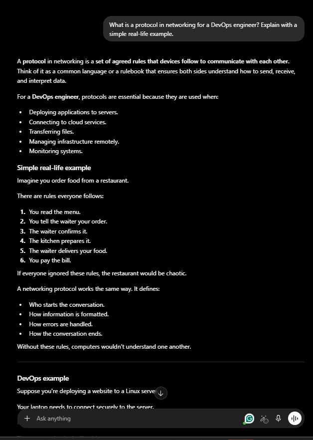
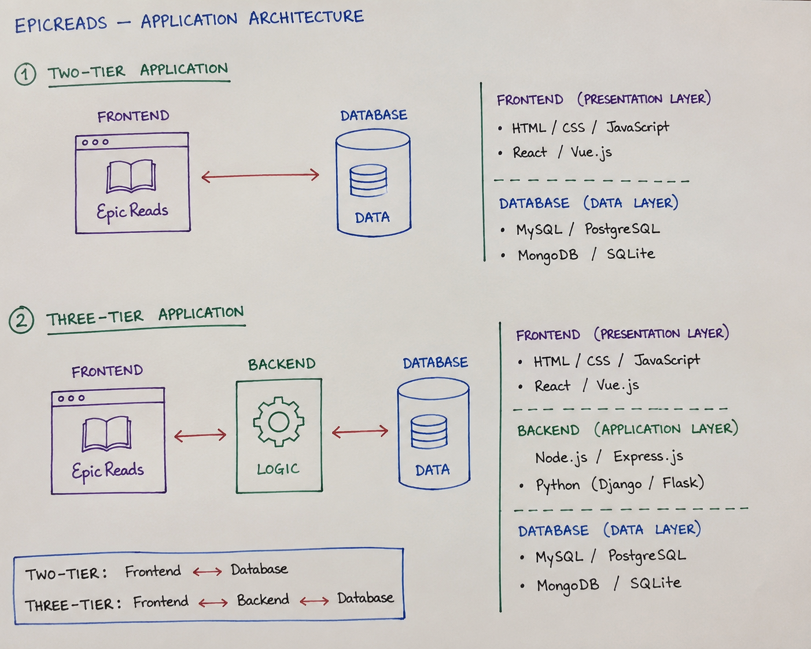
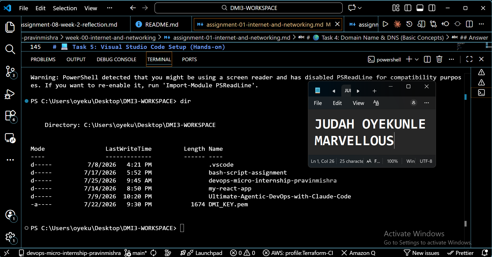

# Week 00 - Internet and Networking

Part of the DevOps Micro Internship (DMI) Cohort 3 with Agentic AI

---

# 🧑‍💻 Task 1: Using ChatGPT as Your Learning Assistant

## Scenario

You're new to DevOps and will frequently encounter technical questions. ChatGPT can be your learning companion.

## Your Task

Write a clear ChatGPT prompt to help you understand:

> "What is a protocol in networking? Explain with a simple real-life example."

Take a screenshot of your interaction showing:

* Your detailed prompt (with clear expectations)
* ChatGPT's simplified response with an example

## Screenshot

Save your screenshot in the `screenshots` folder and update the file name below.




---

## What I Learned (2–3 lines)

A protocol in networking is a set of agreed rules that devices follow to communicate with each other. Think of it as a common language or a rulebook that ensures both sides understand how to send, receive, and interpret data.

---

# 🌐 Task 2: Internet and Networking

## Scenario

Your friend is launching an online bookstore named **EpicReads**.

He asked you to explain how users globally can access his website hosted in Finland.

## Your Task

Write a short explanation (**100–150 words**) that includes:

* Packet Switching
* IP Address
* TCP/IP
* HTTP/HTTPS

💡 **Tip:** You may use ChatGPT (as demonstrated in Task 1) to refine your explanation.

## Answer

When a user anywhere in the world visits the EpicReads website hosted in Finland, their request is broken into small pieces called **packets** through **packet switching**. Each packet travels across the internet, possibly using different routes, before being reassembled at the destination. Every device involved has an **IP address**, which acts like a digital home address to ensure the packets reach the correct server. The **TCP/IP** protocol suite manages the communication by routing the packets and ensuring they arrive accurately and in the correct order. Once the connection is established, **HTTP** or the more secure **HTTPS** protocol is used to transfer the website's pages and data between the user's browser and the EpicReads server. This process allows people worldwide to access the online bookstore quickly, reliably, and securely.

---

# 🏗️ Task 3: Application Architecture & Stack

## Scenario

EpicReads bookstore has two application versions:

### Two-Tier Application

* Frontend
* Database

### Three-Tier Application

* Frontend
* Backend
* Database

## Your Task

* Draw simple diagrams (hand-drawn or tool-based such as draw.io)
* Label each layer clearly
* List at least two common technologies or tools used for each layer
* Submit a screenshot or photo clearly showing your own drawing

## Diagram Screenshot / Photo

Save your diagram image in the `screenshots` folder and update the file name below.



---

## Technologies Used

### Frontend

HTML, CSS, JavaScript
React.js

### Backend

Node.js with Express.js
Python with Django

### Database

PostgreSQL
MySQL

---

# 🌍 Task 4: Domain Name & DNS (Basic Concepts)

## Scenario

Your friend's bookstore **EpicReads** is currently accessible through:

```text
52.172.142.222:3000
```

He purchased the domain:

```text
epicreads.com
```

## Your Task

In **50–100 words**, explain in your own words:

1. What is DNS (Domain Name System)?
2. Which DNS record type should be used to connect the domain to the given IP, and why?

## Answer

The **Domain Name System (DNS)** is like the internet's phonebook. It translates easy-to-remember domain names, such as **epicreads.com**, into IP addresses that computers use to locate websites. To connect **epicreads.com** to the IP address **52.172.142.222**, an **A (Address) record** should be used because it maps a domain name directly to an IPv4 address. This allows users to access the website by typing the domain name instead of remembering the numeric IP address.


---

# 💻 Task 5: Visual Studio Code Setup (Hands-on)

## Your Task

Install Visual Studio Code (if not already installed).

Take a screenshot of your VS Code environment showing:

* Terminal open inside VS Code
* Running a basic command:

### Windows

```powershell
dir
```

### Linux / macOS

```bash
pwd
ls
```

* Your selected VS Code theme clearly visible

⚠️ **Important:** The screenshot must show your username or another identifiable detail to confirm it is your environment.

## Screenshot

Save your screenshot in the `screenshots` folder and update the file name below.




---

# 🔗 Task 6: Publish Your Assignment as a LinkedIn Post

## Objective

Publishing on LinkedIn helps you:

* Build your professional online presence
* Reinforce your learning
* Document your DevOps journey publicly

## Your Task

Summarize your answers from Tasks 1–5 into a LinkedIn post.

Clearly structure your post into the following sections:

* ChatGPT
* Internet & Networking
* App Architecture
* DNS
* VS Code Setup

Add the following credit note at the end of your post:

> **P.S. This post is part of the DevOps Micro Internship (DMI) with Agentic AI — Cohort 3 — by Pravin Mishra. My graded progress is public: https://dmi.pravinmishra.com/s/YOUR-GITHUB-USERNAME.html · Start your DevOps journey: https://dmi.pravinmishra.com/?utm_source=student&utm_medium=ps-linkedin&utm_campaign=cohort3**

---

## LinkedIn Post URL

Paste your LinkedIn post URL here:

```text
https://www.linkedin.com/posts/judah-oyekunle-devops-engineer_devops-micro-internship-dmi-by-pravin-activity-7442203473045213184-eDpT?utm_source=share&utm_medium=member_desktop&rcm=ACoAAD1QcSsBayL-iIJCb39J7WoJCnjtf7N2fMA
```

---

## LinkedIn Post Backup Copy

Paste the full text of your LinkedIn post here:

🚀 DevOps Learning Journey – Building & Understanding EpicReads
Here’s a quick breakdown of key concepts I explored while working on a real-world scenario for an online bookstore, EpicReads:


💡 ChatGPT
Used ChatGPT as a learning assistant to simplify complex DevOps and networking concepts into practical, real-world understanding. It helped bridge the gap between theory and real application.


🌐 Internet & Networking
A protocol is simply a set of rules that allows systems to communicate. When users access EpicReads globally, technologies like TCP/IP, HTTP/HTTPS, IP Addressing, and Packet Switching ensure data is transmitted reliably from the server in Finland to users anywhere in the world.


🏗️ App Architecture
Two-Tier Architecture:
Frontend → Database
Frontend: React, Nginx
Database: MySQL, MongoDB
Three-Tier Architecture:
Frontend → Backend → Database
Frontend: React, Angular
Backend: Node.js, Spring Boot
Database: PostgreSQL, MongoDB
This separation improves scalability, security, and maintainability.


🌍 DNS
The Domain Name System (DNS) translates domain names into IP addresses. To connect epicreads.com to the server (52.172.142.222), an A record is used because it directly maps the domain to an IPv4 address.


🛠️ VS Code Setup
Set up a development environment using VS Code for building and testing applications locally. Integrated tools like terminal, extensions, and Git support streamline development and deployment workflows.


📌 Key Takeaway:
Understanding how networking, architecture, and DNS work together is essential for building scalable and production-ready applications as a DevOps engineer.

P.S. This post is part of the FREE DevOps Micro Internship Cohort run by Pravin Mishra. You can start your DevOps journey for free from his YouTube Playlist. https://lnkd.in/er6wf298.

---

# Reflection – Week 0

### What did you find easy?

Giving the prompt to chatgpt

---

### What was difficult?

Explaining DNS

---

### What will you improve next week?

Improve my prompting skill

---

## 📌 About DMI & CloudAdvisory

DevOps Micro Internship (DMI) is a project-based DevOps program run by Pravin Mishra (The CloudAdvisory) focused on real-world execution, systems thinking, and career readiness.

It helps learners build strong DevOps foundations with hands-on experience.


## 📌 Resources

- 🌐 **DMI Official Website:** https://pravinmishra.com/dmi  
- 🎓 **DevOps for Beginners (Udemy):** https://www.udemy.com/course/devops-for-beginners-docker-k8s-cloud-cicd-4-projects/  
- 🎓 **Ultimate Agentic AI DevOps with Clude Code** https://www.udemy.com/course/ultimate-agentic-ai-devops-with-claude-code/?referralCode=448389767BC96284087B
- 🎓 **DevOps with Claude Code: Terraform, EKS, ArgoCD & Helm** https://www.udemy.com/course/devops-with-claude-code-terraform-eks-argocd-helm/?referralCode=1C5B734505D65A010FA3
- ▶️ **YouTube Playlist (DMI Cohort 3):** https://www.youtube.com/playlist?list=PLFeSNDtI4Cho  
- 🔗 **Pravin Mishra (LinkedIn):** https://www.linkedin.com/in/pravin-mishra-aws-trainer/  
- 🏢 **CloudAdvisory (LinkedIn):** https://www.linkedin.com/company/thecloudadvisory/

---

*This submission is part of DevOps Micro Internship (DMI) Cohort 3 — Agentic AI Track*