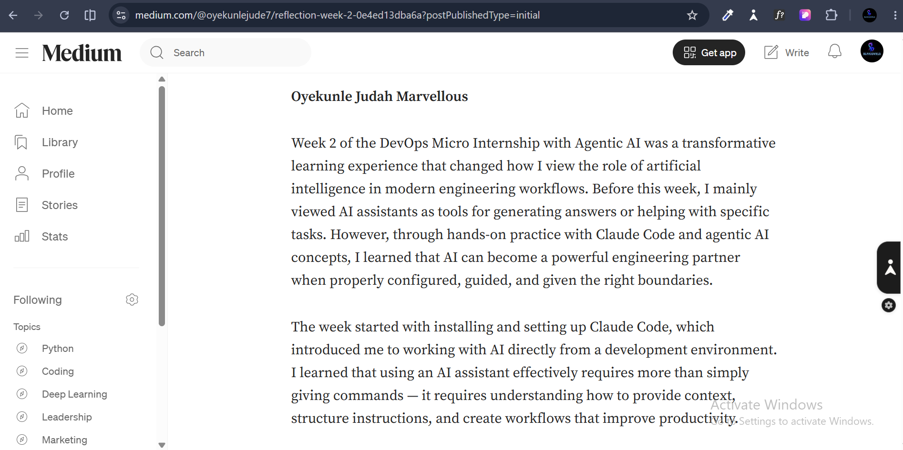
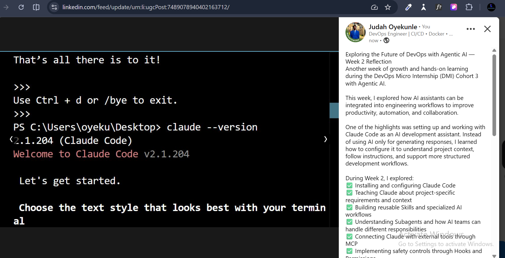

# Assignment 8 — Week 2 Reflection Blog

Part of the DevOps Micro Internship (DMI) Cohort 3 with Agentic AI

---

# Purpose

In this assignment, you will reflect on your Week 2 learning journey and write a short blog capturing your experience working with Agentic AI tools such as Claude Code, Skills, Subagents, MCP, Hooks, Permissions, and Memory.

You will also publish a LinkedIn post summarizing your learning and share both links for evaluation.

---

# Task 1 — Write Your Reflection Blog

## Goal

Write a reflection blog covering your Week 2 learning experience.

### Blog Requirements

Your blog must include:

* Title: **Reflection – Week 2**
* Minimum 300 words
* At least 2–3 topics from Week 2 (Claude Code, Skills, Subagents, MCP, Hooks, Permissions, Memory)
* Honest personal reflection (learning, challenges, mindset)
* One habit/system you plan to implement
* Your full name clearly visible

### Allowed Platforms

You can publish your blog on:

* Hashnode
* Medium
* Dev.to
* LinkedIn Article
* GitHub Markdown file
* Substack

---

### Evidence

#### Screenshot 1 — Blog published and visible



---

### Submission Field

Blog Link:

`https://medium.com/@oyekunlejude7/reflection-week-2-0e4ed13dba6a`

---

# Task 2 — Create LinkedIn Post

## Goal

Share your Week 2 learning publicly on LinkedIn.

---

### LinkedIn Post Requirements

Your post must include:

* One screenshot from any Week 2 assignment
* Short reflection (what you learned or built)
* Required P.S. line exactly as given below

---

### Required P.S. Line (Must Include Exactly)

> **P.S. This post is part of the DevOps Micro Internship (DMI) with Agentic AI — Cohort 3 — by [Pravin Mishra](https://www.linkedin.com/in/pravin-mishra-aws-trainer/). My graded progress is public: https://dmi.pravinmishra.com/s/YOUR-GITHUB-USERNAME.html · Start your DevOps journey: https://dmi.pravinmishra.com/?utm_source=student&utm_medium=ps-linkedin&utm_campaign=cohort3**

---

### Suggested Hashtags

#DMIByPravinMishra #AgenticAI #ClaudeCode #DevOps #LearningInPublic

---

### Evidence

#### Screenshot 2 — LinkedIn post published



---

### Submission Field

LinkedIn Post Content (copy-paste here):

```
Exploring the Future of DevOps with Agentic AI — Week 2 Reflection

Another week of growth and hands-on learning during the DevOps Micro Internship (DMI) Cohort 3 with Agentic AI.

This week, I explored how AI assistants can be integrated into engineering workflows to improve productivity, automation, and collaboration.

One of the highlights was setting up and working with Claude Code as an AI development assistant. Instead of using AI only for generating responses, I learned how to configure it to understand project context, follow instructions, and support more structured development workflows.

During Week 2, I explored:

✅ Installing and configuring Claude Code
✅ Teaching Claude about project-specific requirements and context
✅ Building reusable Skills and specialized AI workflows
✅ Understanding Subagents and how AI teams can handle different responsibilities
✅ Connecting Claude with external tools through MCP
✅ Implementing safety controls through Hooks and Permissions
✅ Using Memory to maintain project knowledge across sessions

One of the biggest lessons I learned is that effective AI adoption requires more than just using powerful tools—it requires good systems, clear instructions, and responsible implementation.

I also gained a deeper appreciation for the importance of safety and reliability when building AI-powered workflows. Automation can increase productivity, but proper controls and human decision-making remain essential.

This week challenged me to think differently about the future of DevOps: not as replacing engineers, but as creating smarter workflows where humans and AI collaborate to solve problems more efficiently.

I'm excited to continue exploring AI-assisted development, cloud engineering, automation, and DevOps practices while building more real-world projects.


P.S. This post is part of the DevOps Micro Internship (DMI) with Agentic AI — Cohort 3 — by Pravin Mishra.
My graded progress is public: https://github.com/Judahforge/devops-micro-internship-pravinmishra

Start your DevOps journey:
https://dmi.pravinmishra.com/?utm_source=student&utm_medium=ps-linkedin&utm_campaign=cohort3

#DMIByPravinMishra #DevOps #AgenticAI #ClaudeCode #AIEngineering #Automation #CloudComputing #AWS #GitHub #ContinuousLearning #LearningInPublic #OpenToWork
```

---

### LinkedIn Post Link:

`https://www.linkedin.com/posts/judah-oyekunle-devops-engineer_dmibypravinmishra-devops-agenticai-ugcPost-7489078940402163712-8P2H/?utm_source=share&utm_medium=member_desktop&rcm=ACoAAD1QcSsBayL-iIJCb39J7WoJCnjtf7N2fMA`

---

# Submission Instructions

* Blog must be publicly accessible
* LinkedIn post must be visible (public or unlisted where applicable)
* All required fields must be filled
* Screenshot proofs must be added to GitHub repository
* Do not include sensitive information in blog or post

---

# Completion Checklist

* [ ] Blog written with required structure
* [ ] Blog includes at least 2–3 Week 2 topics
* [ ] Blog is publicly accessible
* [ ] LinkedIn post created
* [ ] Required P.S. line included
* [ ] LinkedIn post content copied in submission field
* [ ] Blog link added
* [ ] LinkedIn post link added
* [ ] Screenshots added to GitHub repo

---

# About DMI & CloudAdvisory

DevOps Micro Internship (DMI) is a project-based DevOps program run by Pravin Mishra (The CloudAdvisory), focused on real-world execution, systems thinking, and agentic AI workflows.

It helps learners build strong DevOps foundations through hands-on experience.

---

# Resources

* 🌐 DMI Official Website: [https://dmi.pravinmishra.com?utm_source=github&utm_medium=readme](https://dmi.pravinmishra.com?utm_source=github&utm_medium=readme)
* 🎓 University: [https://university.pravinmishra.com?utm_source=github&utm_medium=readme](https://university.pravinmishra.com?utm_source=github&utm_medium=readme)
* 💬 Discord Community: [https://discord.pravinmishra.com?utm_source=github&utm_medium=readme](https://discord.pravinmishra.com?utm_source=github&utm_medium=readme)
* 📝 Blog: [https://dmi.pravinmishra.com/blog?utm_source=github&utm_medium=readme](https://dmi.pravinmishra.com/blog?utm_source=github&utm_medium=readme)
* ▶️ YouTube Playlist: [https://www.youtube.com/playlist?list=PLFeSNDtI4Cho](https://www.youtube.com/playlist?list=PLFeSNDtI4Cho)
* 🔗 Pravin Mishra (LinkedIn): [https://www.linkedin.com/in/pravin-mishra-aws-trainer/](https://www.linkedin.com/in/pravin-mishra-aws-trainer/)
* 🏢 CloudAdvisory (LinkedIn): [https://www.linkedin.com/company/thecloudadvisory/](https://www.linkedin.com/company/thecloudadvisory/)

