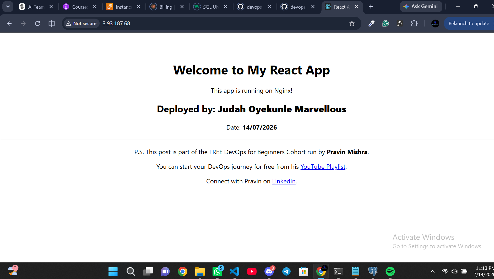
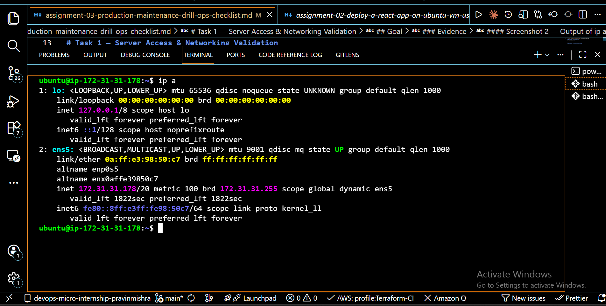
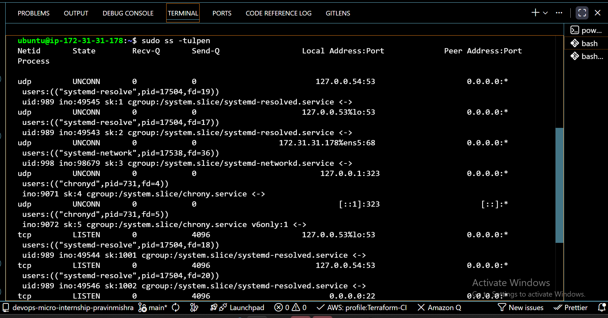
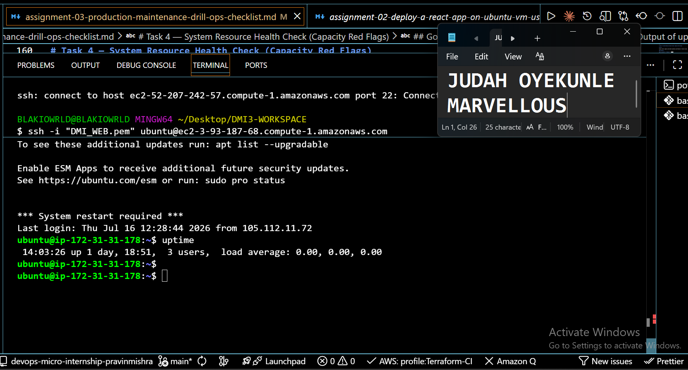
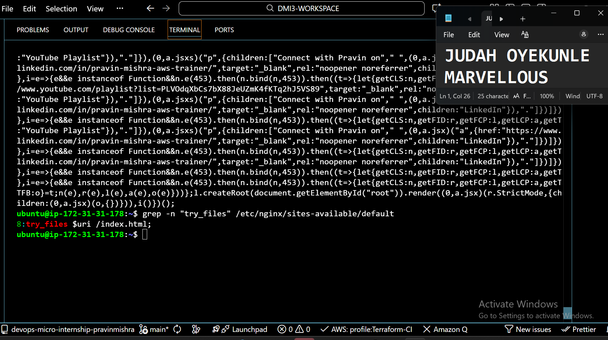
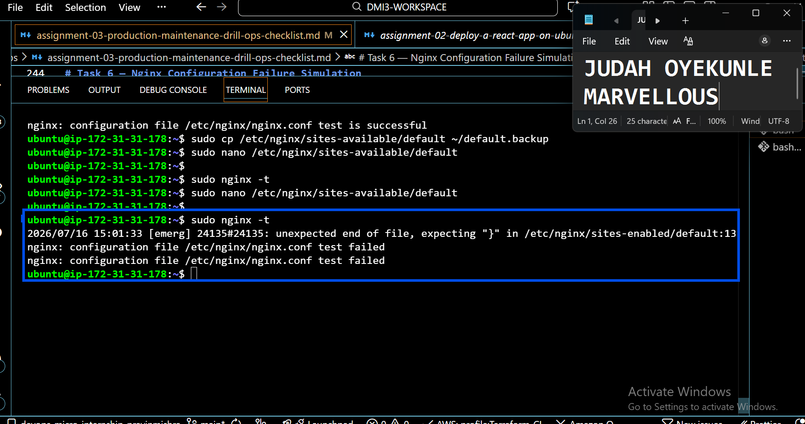
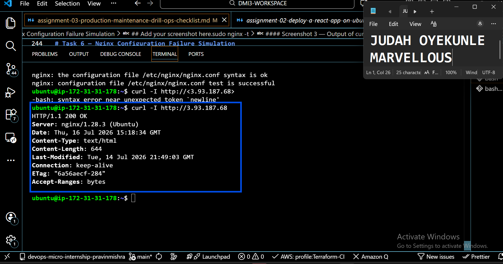
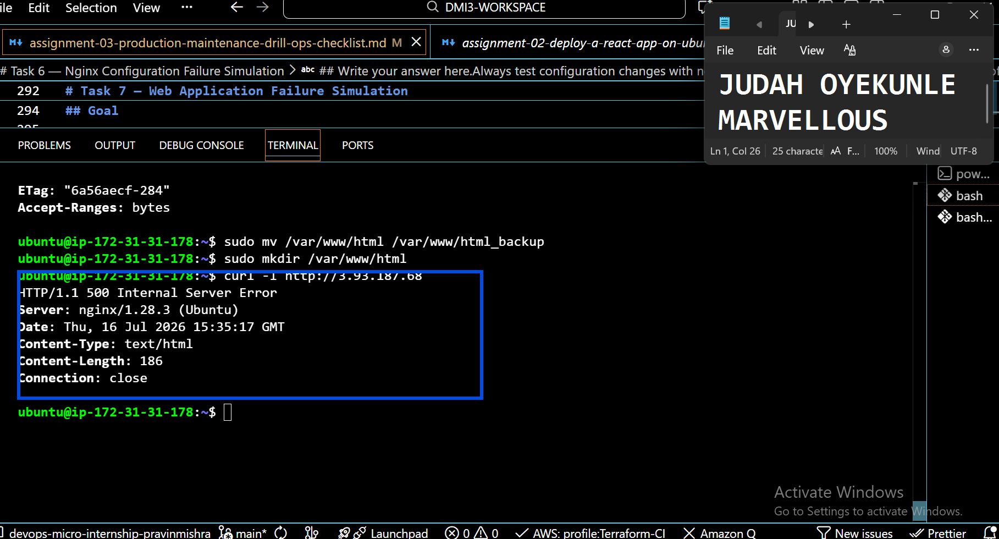
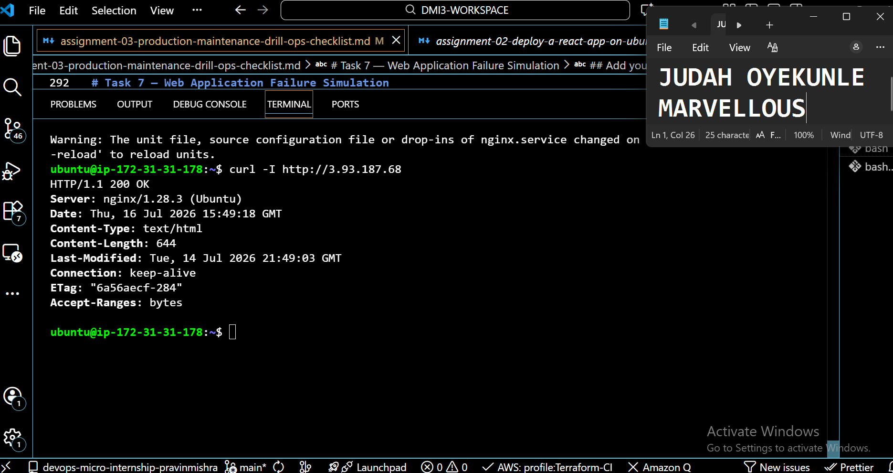
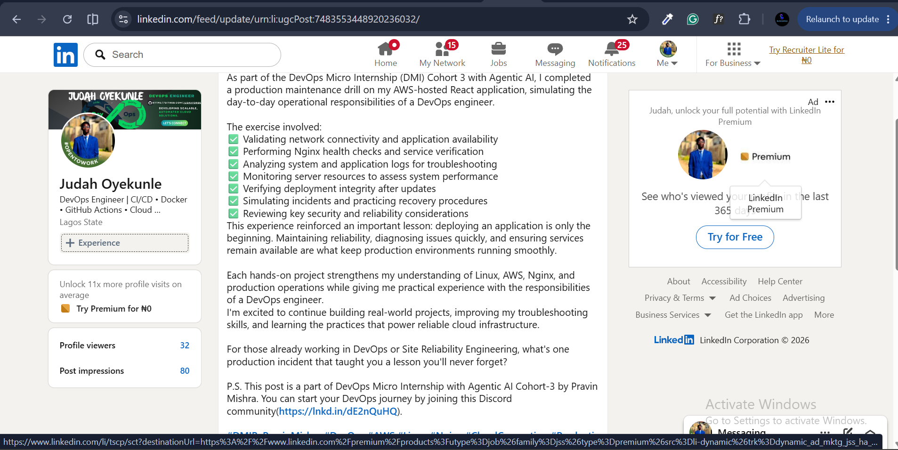

# Assignment 3 — Production Maintenance Drill (OPS Checklist)

Part of the DevOps Micro Internship (DMI) Cohort 3 with Agentic AI

---

## Purpose

In this assignment, you will treat your already deployed React application (on Ubuntu VM with Nginx) as a live production system. You will perform structured operational checks covering network validation, service health, log analysis, resource monitoring, configuration verification, and incident simulation with recovery — mirroring real on-call DevOps responsibilities.

---

# Task 1 — Server Access & Networking Validation

## Goal

Verify that the deployed React application is reachable from the browser and confirm basic network connectivity of the Ubuntu VM.

### Evidence

#### Screenshot 1 — Browser showing the React app with your Full Name visible on the UI

Add your screenshot here.

#### Screenshot 2 — Output of `ip a`

Add your screenshot here.

#### Screenshot 3 — Output of `sudo ss -tulpen`

Add your screenshot here.

#### Screenshot 4 — Output of `sudo ufw status`

Add your screenshot here.

### Notes

Answer the following in your own words:

**1. What proves Nginx is listening on 0.0.0.0:80?**

Write your answer here.
The output of the ss -tulpen command also indicates that nginx is listening on 0.0.0.0:80, which is the web server port.
---

**2. What proves SSH is active on port 22?**

Write your answer here.
The ss -tulpen command makes sure that port 22 is open and thus the server is accessible
---

**3. Did you find any unexpected open ports? Explain briefly.**

Write your answer here.

No. Only the expected ports for SSH and Nginx were open, which reduces unnecessary security risks.

# Task 2 — Service Health & Systemd Validation (Nginx)

## Goal

Verify that Nginx is properly installed, running, enabled at boot, and safely configured.

### Evidence

#### Screenshot 1 — Output of `systemctl status nginx --no-pager`

Add your screenshot here.

---

#### Screenshot 2 — Output of `sudo nginx -t`

Add your screenshot here.

---

#### Screenshot 3 — Output of `sudo ss -lptn '( sport = :80 )'`

Add your screenshot here.

---

### Notes

Answer the following in your own words:

**1. What happens if Nginx fails to restart in production?**

Write your answer here.
If Nginx fails to restart, users won't be able to access the website, causing downtime until the issue is fixed
---

**2. What's your basic rollback plan?**

Write your answer here.
I would restore the previous working Nginx configuration, test it with nginx -t, then restart the service to bring the website back online.
---

# Task 3 — Logs & Request Trace

## Goal

Verify real traffic flow and analyze logs to understand system behavior and errors.

### Evidence

#### Screenshot 1 — Output of `sudo tail -n 30 /var/log/nginx/access.log`

Add your screenshot here.

---

#### Screenshot 2 — Output of `sudo tail -n 30 /var/log/nginx/error.log`

Add your screenshot here.

---

#### Screenshot 3 — Output of `sudo journalctl -u nginx --no-pager -n 50`

Add your screenshot here.

---

### Notes

Answer the following in your own words:

**1. Were there any errors in the logs?**

- If yes, mention 1–2 example error lines from the logs and explain what each one means in simple terms.
- If no, explain what it means if the error log is empty or shows no recent errors during your check.

Write your answer here.
No recent errors were found. This means Nginx handled requests successfully during the check
---

**2. If there were no errors, what does that indicate about the system?**

Write your answer here.
It indicates the web server is working properly and there are no recent configuration or runtime problems.
---

**3. Based on the access logs, were your curl requests visible in the log entries? What does that prove about traffic flow?**

Write your answer here.
Yes. The curl requests appeared in the access log, proving that requests reached the server and Nginx processed them successfully.
---

# Task 4 — System Resource Health Check (Capacity Red Flags)

## Goal

Assess server capacity and detect potential performance or failure risks.

### Evidence

#### Screenshot 1 — Output of `uptime`

Add your screenshot here.

---

#### Screenshot 2 — Output of `free -h`

Add your screenshot here.

---

#### Screenshot 3 — Output of `df -h`

Add your screenshot here.

---

#### Screenshot 4 — Output of `sudo du -sh /var/* | sort -h`

Add your screenshot here.

---

### Notes

Answer the following in your own words:

**1. Which resource looks most critical right now? (CPU/load, memory, or disk) Explain why.**

Write your answer here.
Disk usage is the most important resource to monitor because if it becomes full, the server may stop writing logs or application files.
---

**2. What happens if disk becomes 100% full in a production server?**

Write your answer here.
Applications may stop working, logs cannot be written, updates may fail, and the server could become unstable.
---

# Task 5 — Configuration & Deployment Verification

## Goal

Ensure the correct React build is deployed and Nginx is serving it properly.

### Evidence

#### Screenshot 1 — Output of `ls -lah /var/www/html | head -n 20`

Add your screenshot here.

---

#### Screenshot 2 — Output of `grep -R "Deployed by" -n /var/www/html 2>/dev/null | head`

Add your screenshot here.

---

#### Screenshot 3 — Output of `grep -n "try_files" /etc/nginx/sites-available/default`

Add your screenshot here.

---

### Notes

Answer the following in your own words:

**1. How do you confirm that the correct version of the application is deployed?**

Write your answer here.
I confirm the deployment by checking the files inside /var/www/html, verifying the deployment marker if available, and ensuring the browser displays the latest version of the application.
---

# Task 6 — Nginx Configuration Failure Simulation

## Goal

Simulate a real-world Nginx misconfiguration and recover the service safely.

### Evidence

#### Screenshot 1 — Output of `sudo nginx -t` showing the syntax error (broken config)

Add your screenshot here.

---

#### Screenshot 2 — Output of `sudo nginx -t` showing syntax ok (fixed config)

Add your screenshot here.

---

#### Screenshot 3 — Output of `curl -I http://<public-ip>` confirming recovery (200 OK)

Add your screenshot here.

---

### Notes

Answer the following in your own words:

**1. What caused the configuration failure?**

Write your answer here.
A syntax error was introduced into the Nginx configuration file, preventing Nginx from validating the configuration.
---

**2. How did you fix the issue?**

Write your answer here.
I restored the correct configuration, verified it using nginx -t, and restarted the Nginx service.
---

**3. How can you avoid this kind of issue in real production systems?**

Write your answer here.
Always test configuration changes with nginx -t before restarting Nginx, and keep backups of working configuration files.
---

# Task 7 — Web Application Failure Simulation

## Goal

Simulate missing deployment content and recover the application safely.

### Evidence

#### Screenshot 1 — Output of `curl -I http://<public-ip>` showing failure (non-200 response)

Add your screenshot here.

---

#### Screenshot 2 — Output of `curl -I http://<public-ip>` confirming recovery (200 OK)

Add your screenshot here.

---

### Notes

Answer the following in your own words:

**1. What caused the application to break in this scenario?**

Write your answer here
The deployed website files were missing from the Nginx web root, so Nginx could not serve the application.
---

**2. How did you fix the issue and restore the application?**

Write your answer here.
I restored the original deployment files and restarted Nginx.
---

**3. What steps would you take to prevent this kind of issue in real production systems?**

Write your answer here.
Use deployment backups, version control, automated deployment pipelines, and avoid deleting production files directly.
---

# Task 8 — Security & Reliability Review

## Goal

Review and reflect on the security and reliability practices applied during this assignment.

### Security & Reliability Notes

Answer the following in your own words:

**1. Why is SSH key-based authentication more secure than sharing passwords?**

Write your answer here.
SSH keys are much harder to guess or crack than passwords, making remote access more secure.
---

**2. Why should only required ports be open on a production server?**

Write your answer here.
Keeping only necessary ports open reduces the attack surface and helps protect the server from unauthorized access.
---

**3. Why is it important for Nginx to be enabled on boot?**

Write your answer here.
If the server restarts, Nginx starts automatically, ensuring the website becomes available again without manual intervention.
---

**4. What are the risks of sharing secrets, keys, or credentials publicly?**

Write your answer here.
Attackers could gain unauthorized access to servers, cloud resources, or sensitive data, leading to security breaches and financial loss.
---

**5. Why should cloud resources be stopped or terminated when they are no longer needed?**

Write your answer here.
Unused resources continue to incur charges and may also introduce unnecessary security risks if left running.
---

# LinkedIn Post (Required)

## Evidence

#### LinkedIn Post URL

Paste your LinkedIn post URL here:

`https://www.linkedin.com/posts/judah-oyekunle-devops-engineer_dmibypravinmishra-devops-aws-ugcPost-7483553448920236032-1o5s/?utm_source=share&utm_medium=member_desktop&rcm=ACoAAD1QcSsBayL-iIJCb39J7WoJCnjtf7N2fMA`

---

#### Screenshot — Published LinkedIn post

Add your screenshot here.

---

# Submission Instructions

- Add all required screenshots in your submission
- Full name must be visible in required screenshots
- Do not expose sensitive information (keys, passwords, account IDs)

---

# Completion Checklist

- [ ] Task 1: Screenshots (browser, ip a, ss -tulpen, ufw status) + Notes answered
- [ ] Task 2: Screenshots (nginx status, nginx -t, ss port 80) + Notes answered
- [ ] Task 3: Screenshots (access log, error log, journalctl) + Notes answered
- [ ] Task 4: Screenshots (uptime, free -h, df -h, du -sh) + Notes answered
- [ ] Task 5: Screenshots (ls html, grep deployed by, grep try_files) + Notes answered
- [ ] Task 6: Screenshots (nginx -t fail, nginx -t pass, curl recovery) + Notes answered
- [ ] Task 7: Screenshots (curl failure, curl recovery) + Notes answered
- [ ] Task 8: Security & Reliability Notes answered
- [ ] LinkedIn post published and URL submitted
- [ ] Full Name visible in all required screenshots
- [ ] No sensitive data exposed

---

## 📌 About DMI & CloudAdvisory

DevOps Micro Internship (DMI) is a project-based DevOps program run by Pravin Mishra (The CloudAdvisory) focused on real-world execution, systems thinking, and career readiness.

It helps learners build strong DevOps foundations with hands-on experience.

---

## 📌 Resources

- 🌐 DMI Official Website: https://pravinmishra.com/dmi  
- 🎓 DevOps for Beginners (Udemy): https://www.udemy.com/course/devops-for-beginners-docker-k8s-cloud-cicd-4-projects/  
- 🎓 Agentic AI DevOps with Claude Code: https://www.udemy.com/course/ultimate-agentic-ai-devops-with-claude-code/  
- 🎓 DevOps with Claude Code: Terraform, EKS, ArgoCD & Helm: https://www.udemy.com/course/devops-with-claude-code-terraform-eks-argocd-helm/  
- ▶️ YouTube Playlist: https://www.youtube.com/playlist?list=PLFeSNDtI4Cho  
- 🔗 Pravin Mishra (LinkedIn): https://www.linkedin.com/in/pravin-mishra-aws-trainer/  
- 🏢 CloudAdvisory (LinkedIn): https://www.linkedin.com/company/thecloudadvisory/

---

*This submission is part of DevOps Micro Internship (DMI) Cohort 3 — Agentic AI Track.*