# Assignment 5 — Bash Script Automation Drill (OPS Checklist)

Part of the DevOps Micro Internship (DMI) Cohort 3 with Agentic AI

---

## Purpose

In this assignment, you will practice Bash scripting by building a series of small automation scripts covering environment setup, variables, arrays, loops, file conditionals, if-else logic, and functions. These scripts form the foundation of real-world Linux automation used in DevOps, cloud, and production support environments.

---

# Task 1 — Bash Environment & Workspace Setup

## Goal

Verify that Bash is available on your system and create a clean workspace for this assignment.

### Evidence

#### Screenshot 1 — Output of `echo $SHELL` and `bash --version`

Add your screenshot here.

---

#### Screenshot 2 — Output of `pwd` and `ls -lah` showing the scripts directory

Add your screenshot here.

---

### Notes

Answer the following in your own words:

**1. What is Bash?**

Add your answer here.
Bash (Bourne Again Shell) is a command-line interpreter used in Linux systems to execute commands and automate tasks through scripts.
---

**2. What is the difference between shell and Bash?**

Add your answer here.
A shell is a program that allows users to communicate with the operating system using commands. Bash is one type of shell with additional features for scripting and automation.
---

**3. Why is it important to confirm the Bash version before writing scripts?**

Add your answer here.
Different Bash versions may support different features. Checking the version ensures that scripts will run correctly in the current environment.
---

# Task 2 — Your First Bash Script

## Goal

Create your first Bash script, make it executable, and run it from the terminal.

### Evidence

#### Screenshot 1 — Content of `first-script.sh`

Add your screenshot here.

---

#### Screenshot 2 — Output of `./first-script.sh`

Add your screenshot here.
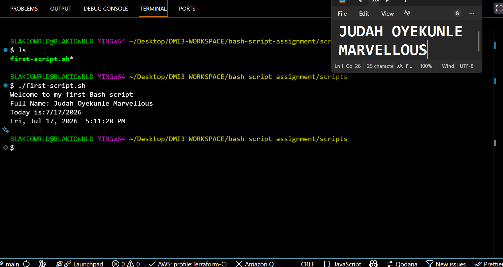
---

#### Screenshot 3 — Output of `ls -l first-script.sh` showing executable permission

Add your screenshot here.
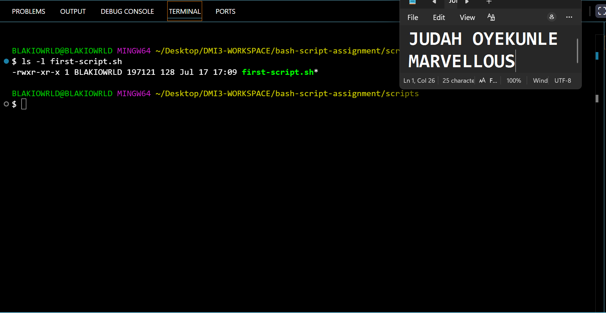
---

### Notes

Answer the following in your own words:

**1. What is the purpose of `#!/bin/bash`?**

Add your answer here.
It tells the operating system that the script should be executed using the Bash interpreter.
---

**2. Why do we use `chmod +x` before running a script?**

Add your answer here.
chmod +x gives the script executable permission, allowing it to run like a program.
---

**3. What is the difference between running a script using `./script.sh` and `bash script.sh`?**

Add your answer here.
./script.sh runs the script directly and requires executable permission. bash script.sh runs the script through Bash without needing executable permission.
---

# Task 3 — Variables: User Information Script

## Goal

Use variables to store and display user-related information.

### Evidence

#### Screenshot 1 — Content of `user-info.sh`

Add your screenshot here.
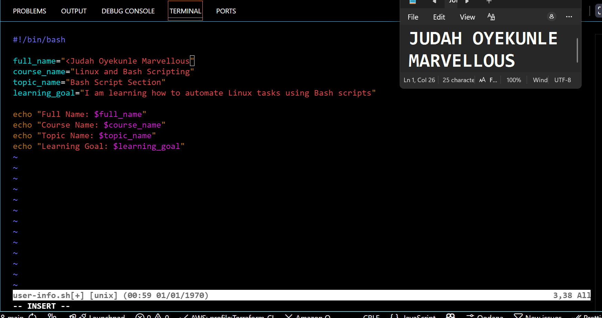
---

#### Screenshot 2 — Output of `./user-info.sh`

Add your screenshot here.
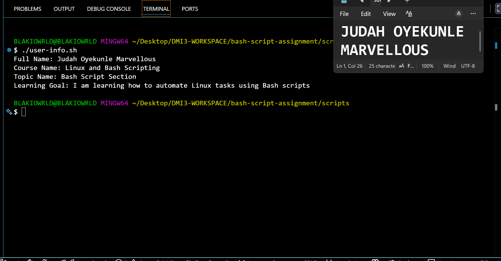
---

### Notes

Answer the following in your own words:

**1. What is a variable in Bash?**

Add your answer here.
A variable is a container used to store information that can be reused inside a script.
---

**2. Why should we avoid spaces around the `=` sign when creating variables?**

Add your answer here.
Bash sees it as a command
---

**3. How do you access the value stored inside a Bash variable?**

Add your answer here.
by adding $
---

# Task 4 — Arrays & Loops: Tools Checklist Script

## Goal

Use arrays and loops to print a checklist of tools used in Bash scripting.

### Evidence

#### Screenshot 1 — Content of `tools-checklist.sh`

Add your screenshot here.
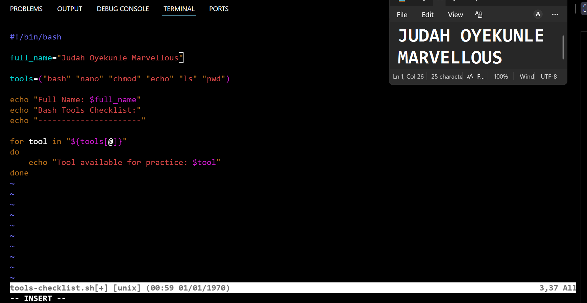
---

#### Screenshot 2 — Output of `./tools-checklist.sh`

Add your screenshot here.
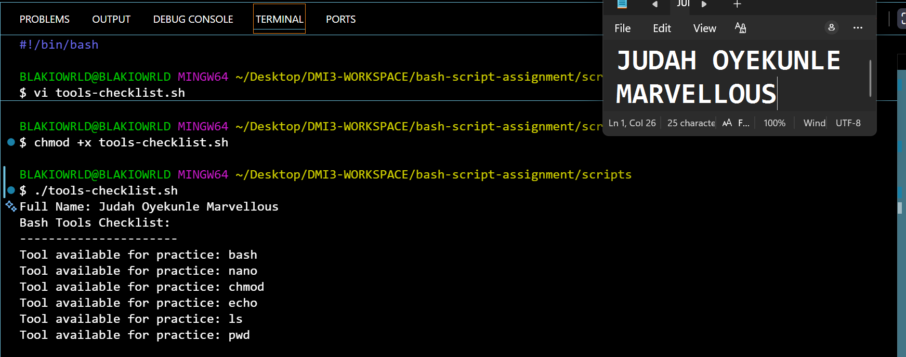
---

### Notes

Answer the following in your own words:

**1. What is an array in Bash?**

Add your answer here.
An array is a variable that stores multiple values in one place.
---

**2. Why are arrays useful in scripts?**

Add your answer here.
Arrays make it easier to manage and process multiple related items.
---

**3. What does `"${tools[@]}"` mean?**

Add your answer here.
It represents all values stored inside the tools array.
---

**4. What is the purpose of the `for` loop in this script?**

Add your answer here.
It repeats an action for every item inside the array.
---

# Task 5 — Loops: Number Counter Script

## Goal

Use loops to repeat a task multiple times.

### Evidence

#### Screenshot 1 — Content of `counter.sh`

Add your screenshot here.
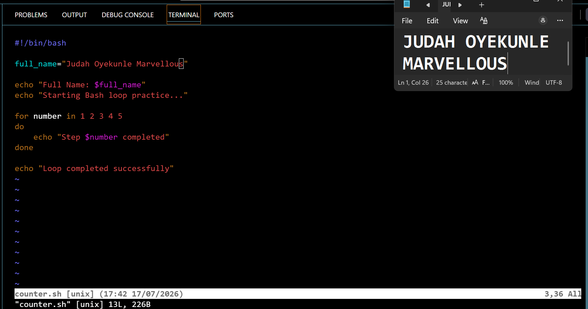
---

#### Screenshot 2 — Output of `./counter.sh`

Add your screenshot here.
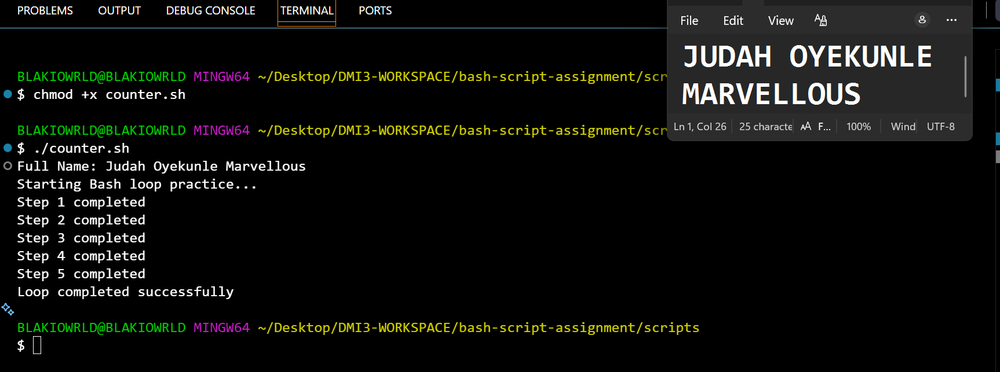
---

### Notes

Answer the following in your own words:

**1. What is a loop?**

Add your answer here.
A loop repeats a set of commands multiple times until a condition is completed.
---

**2. Why do we use loops in Bash scripting?**

Add your answer here.
They reduce repeated commands and make automation easier.
---

**3. How many times did the loop run in your script?**

Add your answer here.
5 times.
---

**4. What would you change if you wanted the loop to run 10 times?**

Add your answer here.
change {1..5} to {1..10}
---

# Task 6 — Files & Conditionals: File Validation Script

## Goal

Use file checks and conditionals to verify whether files and directories exist.

### Evidence

#### Screenshot 1 — Output of `ls -lah ../test-folder`

Add your screenshot here.

---

#### Screenshot 2 — Content of `file-check.sh`

Add your screenshot here.
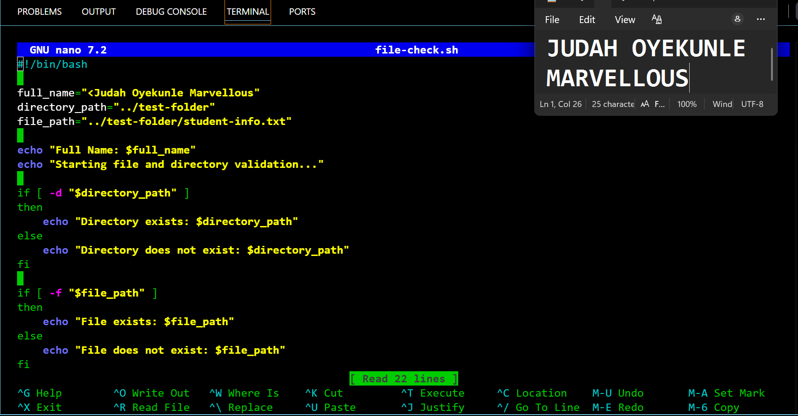
---

#### Screenshot 3 — Output of `./file-check.sh`

Add your screenshot here.
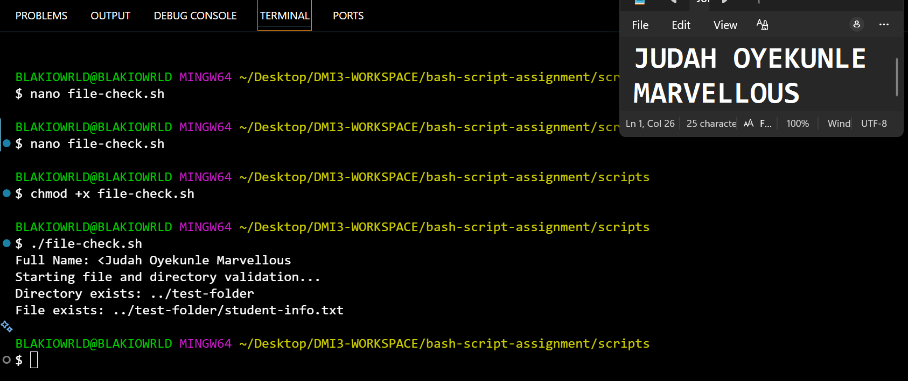
---

### Notes

Answer the following in your own words:

**1. What does `-d` check in Bash?**

Add your answer here.
It checks whether a directory exists.
---

**2. What does `-f` check in Bash?**

Add your answer here.
It checks whether a file exists.
---

**3. Why should file and directory paths be stored in variables?**

Add your answer here.
It makes scripts easier to read, modify, and maintain.
---

**4. What happens if the file does not exist?**

Add your answer here.
The script executes the else statement and displays that the file does not exist.
---

# Task 7 — Conditionals: Pass or Retry Script

## Goal

Use if-else conditionals to make decisions based on a variable value.

### Evidence

#### Screenshot 1 — Content of `score-check.sh` with `score=85`

Add your screenshot here.

---

#### Screenshot 2 — Output showing `Result: Pass`

Add your screenshot here.
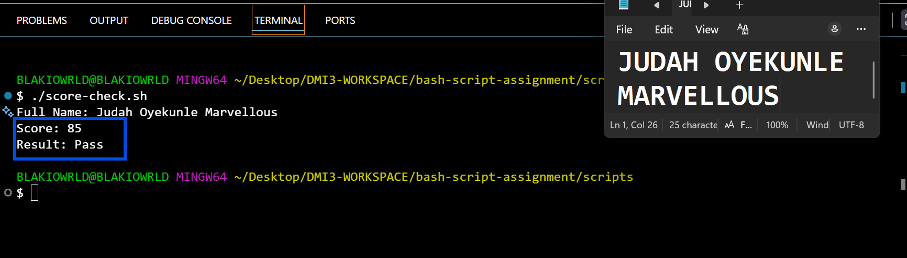
---

#### Screenshot 3 — Content of `score-check.sh` with `score=55`

Add your screenshot here.

---

#### Screenshot 4 — Output showing `Result: Retry`

Add your screenshot here.
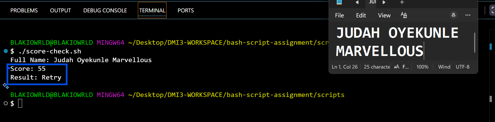
---

### Notes

Answer the following in your own words:

**1. What is the purpose of if-else in Bash?**

Add your answer here.
It allows scripts to make decisions based on conditions.
---

**2. What does `-ge` mean?**

Add your answer here.
Greater than or equal to.
---

**3. Why should conditions be tested with different values?**

Add your answer here.
It ensures the script works correctly in different situations.
---

**4. How can conditionals help in automation scripts?**

Add your answer here.
They allow scripts to automatically choose actions based on different conditions.
---

# Task 8 — Functions: Final Bash Automation Script

## Goal

Create a final Bash script using functions to organize reusable code.

### Evidence

#### Screenshot 1 — Content of `final-automation.sh`

Add your screenshot here.
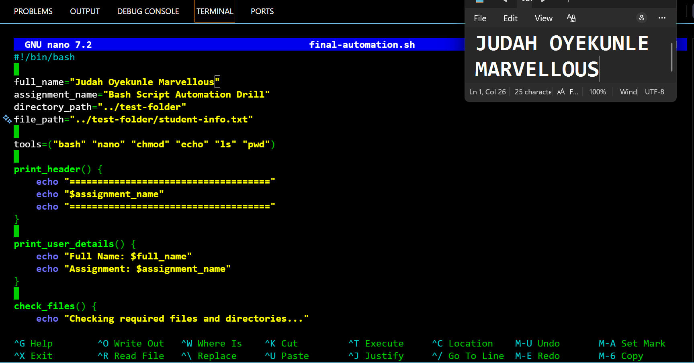
---

#### Screenshot 2 — Output of `./final-automation.sh`

Add your screenshot here.

---

#### Screenshot 3 — Output of `ls -lah` showing all created scripts

Add your screenshot here.
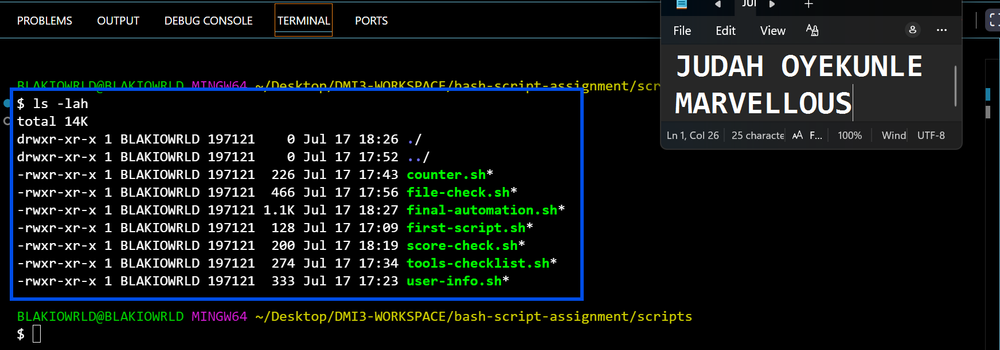
---

### Notes

Answer the following in your own words:

**1. What is a function in Bash?**

Add your answer here.
A function is a reusable block of commands that performs a specific task.
---

**2. Why are functions useful in scripts?**

Add your answer here.
Functions organize scripts, reduce repeated code, and make scripts easier to maintain.
---

**3. Which functions did you create in this script?**

Add your answer here.
I created show_info, show_tools, and check_file functions.
---

**4. How does this final script combine variables, arrays, loops, conditionals, files, and functions?**

Add your answer here.
The script uses variables to store values, arrays to store tools, loops to display items, conditionals to check files, and functions to organize reusable tasks.
---

# LinkedIn Post (Required)

## Evidence

#### LinkedIn Post URL

Paste your LinkedIn post URL here:

`https://www.linkedin.com/posts/judah-oyekunle-devops-engineer_devops-linux-bash-ugcPost-7483997560722944000-a1qW/?utm_source=share&utm_medium=member_desktop&rcm=ACoAAD1QcSsBayL-iIJCb39J7WoJCnjtf7N2fMA`

---

#### Screenshot — Published LinkedIn post

Add your screenshot here.
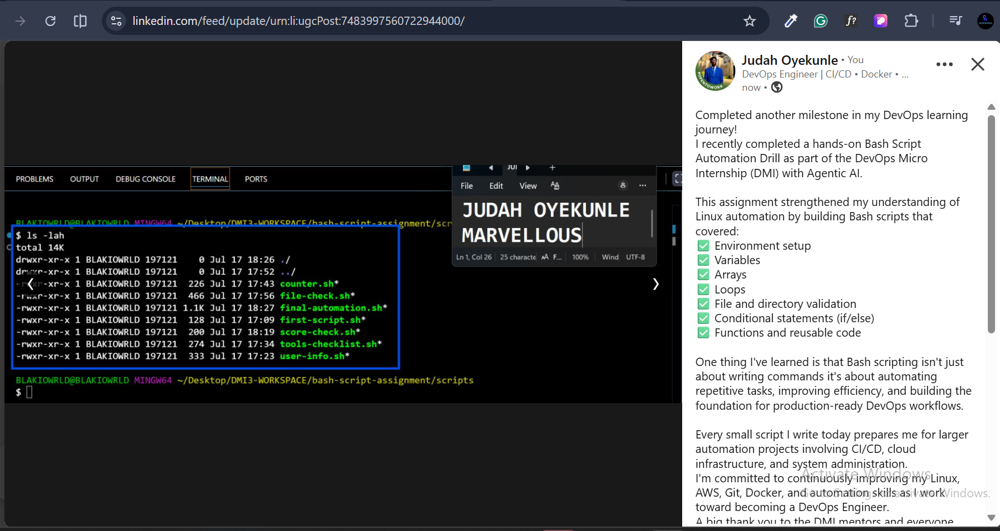
---

# Submission Instructions

- Add all required screenshots in your submission
- Full name must be visible in required screenshots
- All script files must be created and run successfully
- Required notes must be answered clearly for every task
- Do not expose sensitive information (keys, passwords, credentials)

---

# Completion Checklist

- [ ] Task 1: Environment setup verified, workspace created (Screenshots 1–2, Notes answered)
- [ ] Task 2: First script created, executed, permissions verified (Screenshots 1–3, Notes answered)
- [ ] Task 3: Variables script created and run (Screenshots 1–2, Notes answered)
- [ ] Task 4: Arrays and loops script created and run (Screenshots 1–2, Notes answered)
- [ ] Task 5: Counter loop script created and run (Screenshots 1–2, Notes answered)
- [ ] Task 6: File validation script created and run (Screenshots 1–3, Notes answered)
- [ ] Task 7: Pass/Retry conditional script tested with both values (Screenshots 1–4, Notes answered)
- [ ] Task 8: Final automation script created and run (Screenshots 1–3, Notes answered)
- [ ] All scripts run without errors
- [ ] Full Name visible in all required screenshots
- [ ] LinkedIn post published and URL submitted
- [ ] No sensitive data exposed

---

## 📌 About DMI & CloudAdvisory

DevOps Micro Internship (DMI) is a project-based DevOps program run by Pravin Mishra (The CloudAdvisory) focused on real-world execution, systems thinking, and career readiness.

It helps learners build strong DevOps foundations with hands-on experience.

---

## 📌 Resources

- 🌐 DMI Official Website: https://pravinmishra.com/dmi  
- 🎓 DevOps for Beginners (Udemy): https://www.udemy.com/course/devops-for-beginners-docker-k8s-cloud-cicd-4-projects/  
- 🎓 Agentic AI DevOps with Claude Code: https://www.udemy.com/course/ultimate-agentic-ai-devops-with-claude-code/  
- 🎓 DevOps with Claude Code: Terraform, EKS, ArgoCD & Helm: https://www.udemy.com/course/devops-with-claude-code-terraform-eks-argocd-helm/  
- ▶️ YouTube Playlist: https://www.youtube.com/playlist?list=PLFeSNDtI4Cho  
- 🔗 Pravin Mishra (LinkedIn): https://www.linkedin.com/in/pravin-mishra-aws-trainer/  
- 🏢 CloudAdvisory (LinkedIn): https://www.linkedin.com/company/thecloudadvisory/

---

*This submission is part of DevOps Micro Internship (DMI) Cohort 3 — Agentic AI Track.*