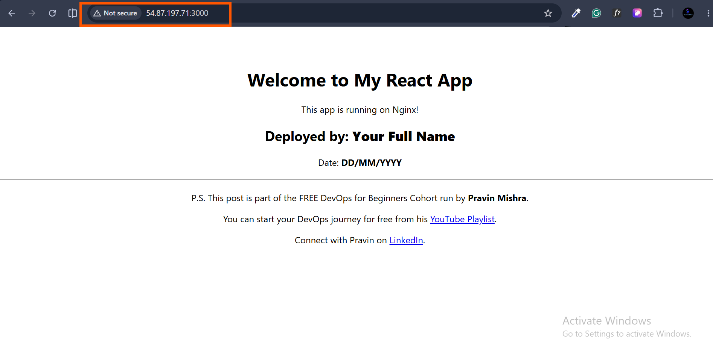
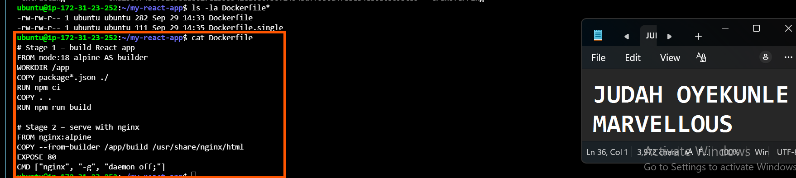
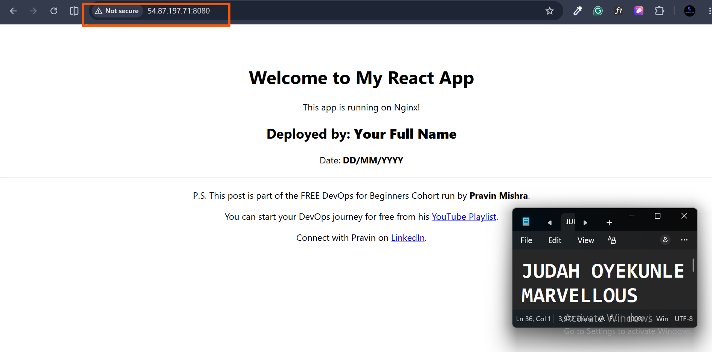
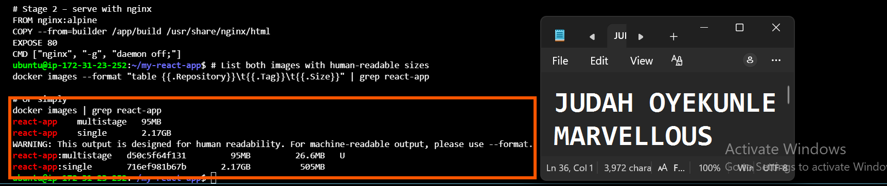
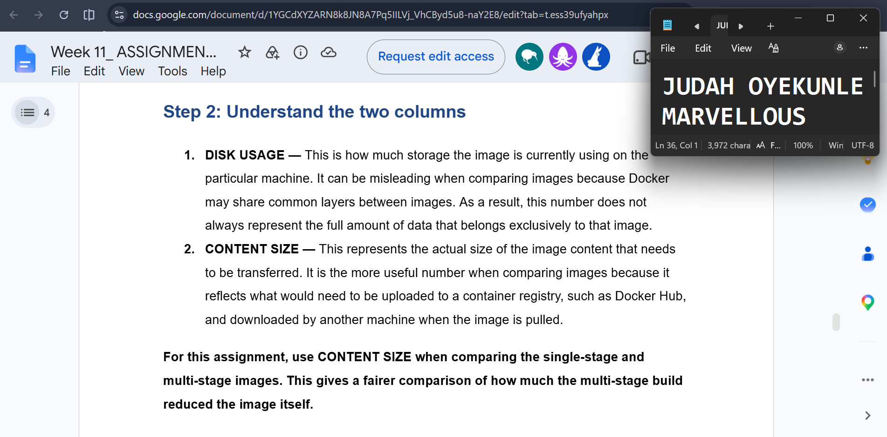
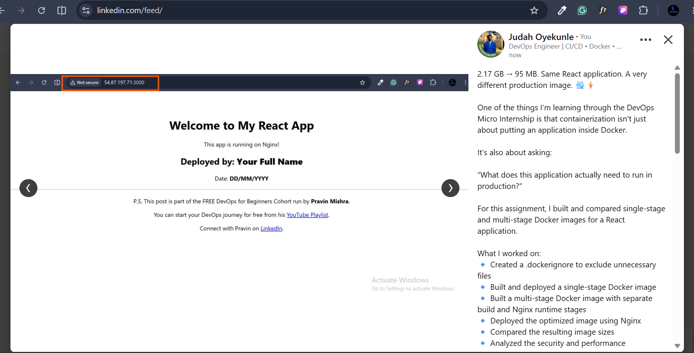

# Assignment 2 — Multi-Stage Docker Build for a React Application

Part of the DevOps Micro Internship (DMI) Cohort 3 with Agentic AI

---

## Purpose

In this assignment, you will build both a single-stage and an optimized multi-stage Docker image for a React application, compare the resulting image sizes, and deploy the optimized version using a production-ready Nginx runtime container.

---

# Task 1 — Prepare the Project

## Goal

Clone `https://github.com/pravinmishraaws/my-react-app.git` and create a `.dockerignore` excluding `node_modules`, `build`, and `.env`.

### Evidence

#### Screenshot 1 — Contents of the `.dockerignore` file

---

# Task 2 — Create a Single-Stage Docker Image

## Goal

Create `Dockerfile.single`, build `react-single`, and run it on port 3000.

### Evidence

#### Screenshot 2 — Contents of `Dockerfile.single`

---

#### Screenshot 3 — Browser displaying the application running from the single-stage container

---

# Task 3 — Create a Multi-Stage Docker Build

## Goal

Create a multi-stage Dockerfile with separate build and Nginx runtime stages, build `react-multistage`, and run it on port 80.

### Evidence

#### Screenshot 4 — Contents of the multi-stage Dockerfile

---

#### Screenshot 5 — Browser displaying the application running from the multi-stage container

---

# Task 4 — Compare Docker Image Sizes

## Goal

Compare the single-stage and multi-stage image sizes and calculate the percentage reduction.

### Evidence

#### Screenshot 6 — Docker image list showing both image sizes

---

# Task 5 — Analyze the Optimization Results

## Goal

Write a 5–8 line analysis covering the percentage reduction, security benefits, reduced attack surface, faster distribution, and one build-caching optimization used.

### Evidence

#### Screenshot 7 — Analysis included in your submission document

---

### Notes

Write your analysis here.

The multi-stage build reduced the final image size from 2.17 GB to 95 MB, a reduction of approximately 95.6% (the multi-stage image is roughly 23× smaller). The single-stage image is large because it ships the full node:20 runtime, the entire node_modules tree, build tooling, and the source code. By discarding that builder stage and copying only the compiled static bundle onto an nginx:alpine base, the production image contains no Node.js runtime, no npm, and no development dependencies. This directly reduces the attack surface, since far fewer binaries, libraries, and packages are present to carry exploitable CVEs. The smaller image also enables faster distribution — it pulls, transfers, and starts in a fraction of the time and consumes ~23× less registry and host disk space. A key build-caching optimization was ordering the Dockerfile so COPY package*.json ./ and npm ci execute before COPY . ., allowing Docker to cache the dependency layer and only re-run npm ci when package.json or package-lock.json changes, rather than on every source edit.

---

# Task 6 — Explore Additional Production Optimizations (Optional)

## Goal

Optionally configure an Nginx health check, cache headers, parameterized ports via environment variables, or a lighter runtime image, and compare results.

> Screenshot optional.

---

# LinkedIn Post (Optional)

## Goal

Create a LinkedIn post describing what you built, what a multi-stage Docker build is, the image size reduction achieved, and key learnings.

## Evidence

#### LinkedIn Post URL

Paste your LinkedIn post URL here:

`https://lnkd.in/p/dRg7d_jr`

---

#### Screenshot — Published LinkedIn post

---

# Submission Instructions

- Add all required screenshots in your submission
- Full name must be visible in required screenshots
- Do not expose sensitive information

---

# Completion Checklist

- [ ] Task 1: `.dockerignore` created (Screenshot 1)
- [ ] Task 2: Single-stage image built and verified (Screenshots 2–3)
- [ ] Task 3: Multi-stage image built and verified (Screenshots 4–5)
- [ ] Task 4: Image sizes compared (Screenshot 6)
- [ ] Task 5: Analysis written (Screenshot 7 & Notes)
- [ ] Task 6: Optional production optimizations explored
- [ ] No sensitive information exposed

---

## 📌 About DMI & CloudAdvisory

DevOps Micro Internship (DMI) is a project-based DevOps program run by Pravin Mishra (The CloudAdvisory) focused on real-world execution, systems thinking, and career readiness.

It helps learners build strong DevOps foundations with hands-on experience.

---

## 📌 Resources

- 🌐 DMI Official Website: https://dmi.pravinmishra.com?utm_source=github&utm_medium=readme  
- 🎓 University: https://university.pravinmishra.com?utm_source=github&utm_medium=readme  
- 💬 Discord Community: https://discord.pravinmishra.com?utm_source=github&utm_medium=readme  
- 📝 Blog: https://dmi.pravinmishra.com/blog?utm_source=github&utm_medium=readme  
- ▶️ YouTube Playlist: https://www.youtube.com/playlist?list=PLFeSNDtI4Cho  
- 🔗 Pravin Mishra (LinkedIn): https://www.linkedin.com/in/pravin-mishra-aws-trainer/  
- 🏢 CloudAdvisory (LinkedIn): https://www.linkedin.com/company/thecloudadvisory/

---

*This submission is part of DevOps Micro Internship (DMI) Cohort 3 — Agentic AI Track.*
