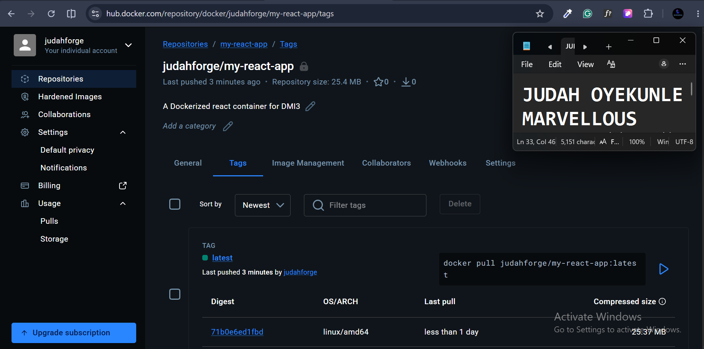
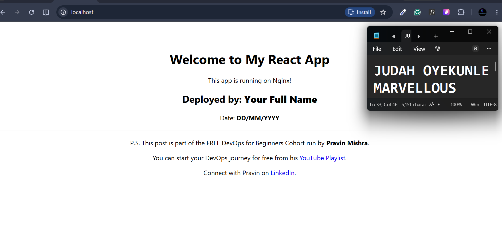

# Assignment 5 — Sharing the Docker Container on Docker Hub

Part of the DevOps Micro Internship (DMI) Cohort 3 with Agentic AI

---

## Purpose

In this assignment, you will publish a Dockerized React application to Docker Hub, then pull and run it to verify it can be downloaded and executed from another system.

---

# Task 1 — Publish a Docker Image to Docker Hub

## Goal

Create a Docker Hub repository (`my-react-app`), log in from the CLI, tag and push your local image, verify it on Docker Hub, then pull and run it to confirm the application is accessible.

### Evidence

#### Screenshot 1 — Docker Hub repository (`my-react-app`)

---

#### Screenshot 2 — Successful `docker login`

---

#### Screenshot 3 — Successful `docker tag`

---

#### Screenshot 4 — Successful `docker push`

---

#### Screenshot 5 — Docker Hub repository showing the uploaded image

---

#### Screenshot 6 — Successful `docker pull`

---

#### Screenshot 7 — Output of `docker ps`

---

#### Screenshot 8 — Browser displaying the running React application

---

# LinkedIn Post (Optional)

## Goal

Create a LinkedIn post covering the assignment title, the Docker Hub repository created, steps performed, key learning outcomes, and a screenshot of the published image.

## Evidence

#### LinkedIn Post URL

Paste your LinkedIn post URL here:

`Add your URL here`

---

#### Screenshot — Published LinkedIn post

Add your screenshot here.

---

# Submission Instructions

- Add all required screenshots in your submission
- Include the Docker Hub repository URL
- Full name must be visible in required screenshots
- Do not expose passwords or sensitive credentials

---

# Completion Checklist

- [ ] Docker Hub account and repository created
- [ ] Docker image tagged and pushed successfully (Screenshots 1–5)
- [ ] Docker image pulled and container run successfully (Screenshots 6–7)
- [ ] React application accessible in the browser (Screenshot 8)
- [ ] No sensitive information exposed

---

## 📌 About DMI & CloudAdvisory

DevOps Micro Internship (DMI) is a project-based DevOps program run by Pravin Mishra (The CloudAdvisory) focused on real-world execution, systems thinking, and career readiness.

It helps learners build strong DevOps foundations with hands-on experience.

---

## 📌 Resources

- 🌐 DMI Official Website: https://dmi.pravinmishra.com?utm_source=github&utm_medium=readme  
- 🎓 University: https://university.pravinmishra.com?utm_source=github&utm_medium=readme  
- 💬 Discord Community: https://discord.pravinmishra.com?utm_source=github&utm_medium=readme  
- 📝 Blog: https://dmi.pravinmishra.com/blog?utm_source=github&utm_medium=readme  
- ▶️ YouTube Playlist: https://www.youtube.com/playlist?list=PLFeSNDtI4Cho  
- 🔗 Pravin Mishra (LinkedIn): https://www.linkedin.com/in/pravin-mishra-aws-trainer/  
- 🏢 CloudAdvisory (LinkedIn): https://www.linkedin.com/company/thecloudadvisory/

---

*This submission is part of DevOps Micro Internship (DMI) Cohort 3 — Agentic AI Track.*
