# Assignment 7 — Capstone: Deploy a Production-Grade Stack for The EpicBook

Part of the DevOps Micro Internship (DMI) with Agentic AI

---

## Purpose

In this assignment, you will deploy the EpicBook application as a production-oriented Docker Compose stack on a cloud VM. You will use optimized container images, isolated networks, health checks, persistent MySQL storage, a selected reverse proxy, logging, backup and restore testing, and reliability procedures.

---

# Task 0 — App Discovery and Architecture

## Goal

Review the EpicBook repository and design the intended application architecture.

### Evidence

#### Screenshot 1 — EpicBook Project Structure

Add a terminal screenshot showing the EpicBook project structure after cloning the repository.

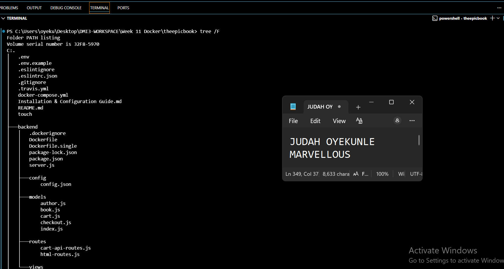

---

#### Screenshot 2 — Architecture Diagram

Add a screenshot of your architecture diagram showing:

- Public user
- Reverse proxy
- Frontend
- Backend
- Database
- Docker networks
- Public and private ports
- Persistent database storage

Add your full name inside the diagram or as a clear caption below it.

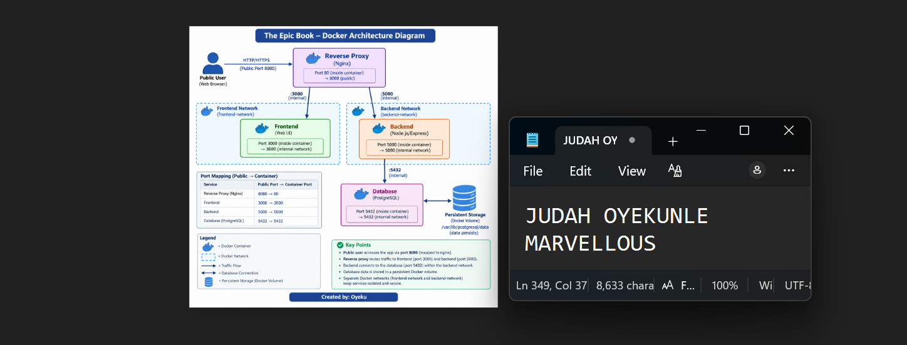

---

#### Screenshot 3 — Environment Variables and Ports Document

Add a screenshot showing the contents of:

```text
docs/02-env-and-ports.md
```

It must document environment-variable names, internal ports, persistent-data details, and the health-check method. Do not expose real credentials or values.

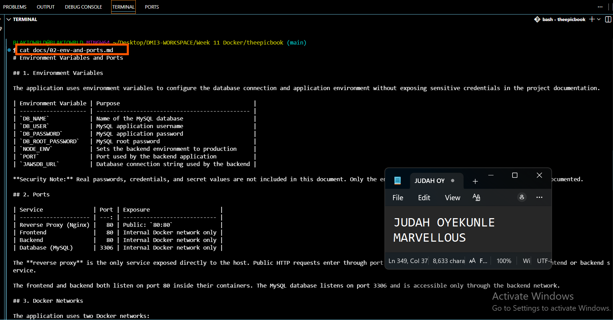

---

# Task 1 — Create Production Docker Images

## Goal

Create optimized production images for the EpicBook backend and frontend.

### Evidence

#### Screenshot 4 — Backend Dockerfile

Add a screenshot showing `backend/Dockerfile`, including:

- Dependency stage
- Minimal runtime stage
- Production startup command
- Internal backend port
- Non-root user configuration

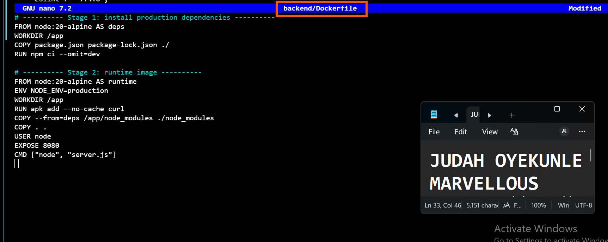

---

#### Screenshot 5 — Frontend Dockerfile

Add a screenshot showing `frontend/Dockerfile`, including:

- Nginx runtime image
- Static frontend files copied to the Nginx web root

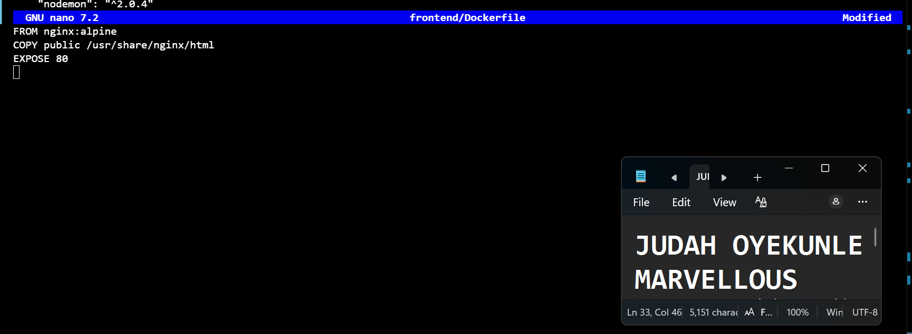

---

#### Screenshot 6 — Docker Ignore Files

Add a screenshot showing both:

```text
backend/.dockerignore
frontend/.dockerignore
```

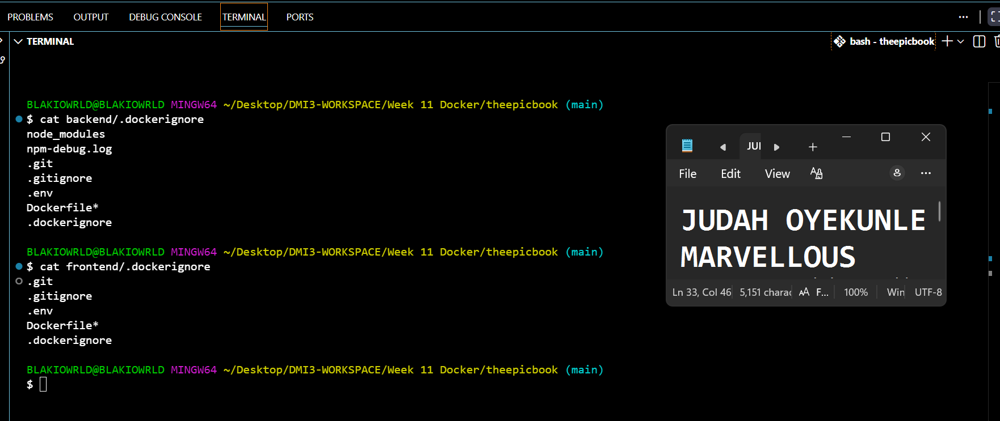

---

#### Screenshot 7 — Docker Image Builds and Size Comparison

Add a terminal screenshot showing successful builds of:

- Baseline backend image
- Optimized backend image
- Frontend image

The screenshot must also show the baseline and optimized backend image-size comparison.


---

#### Screenshot 8 — Backend Running as Non-Root User

Add a terminal screenshot showing the optimized backend container running as a non-root user.

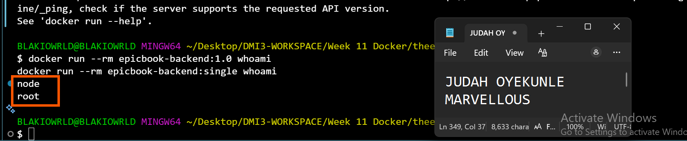

---

### Notes

Write a short note covering:

- Baseline and optimized backend image sizes
- The image-size reduction achieved
- One Docker layer-caching optimization used
- The security benefit of running the backend as a non-root user

### Notes

The baseline backend image was larger because it contained unnecessary files and dependencies. The optimized backend image was reduced by using a more efficient Docker build process and excluding unnecessary files.

The image-size reduction improves build and deployment speed, reduces storage usage, and makes the application easier to distribute through a container registry.

One Docker layer-caching optimization used was copying the dependency files, such as `package.json` and `package-lock.json`, and installing dependencies before copying the rest of the application source code. This allows Docker to reuse the dependency-installation layer when only application code changes.

The backend also runs as a non-root user. This improves security by limiting the privileges available to the application inside the container. If the application is compromised, the attacker has fewer permissions than they would have if the application were running as the root user.


---

# Task 2 — Create the Docker Compose Stack and Networks

## Goal

Create one Docker Compose stack containing the reverse proxy, frontend, backend, and MySQL database.

### Evidence

#### Screenshot 9 — Docker Compose Services

Add a screenshot showing `docker-compose.yml` with all four services:

```text
reverse-proxy
frontend
backend
database
```

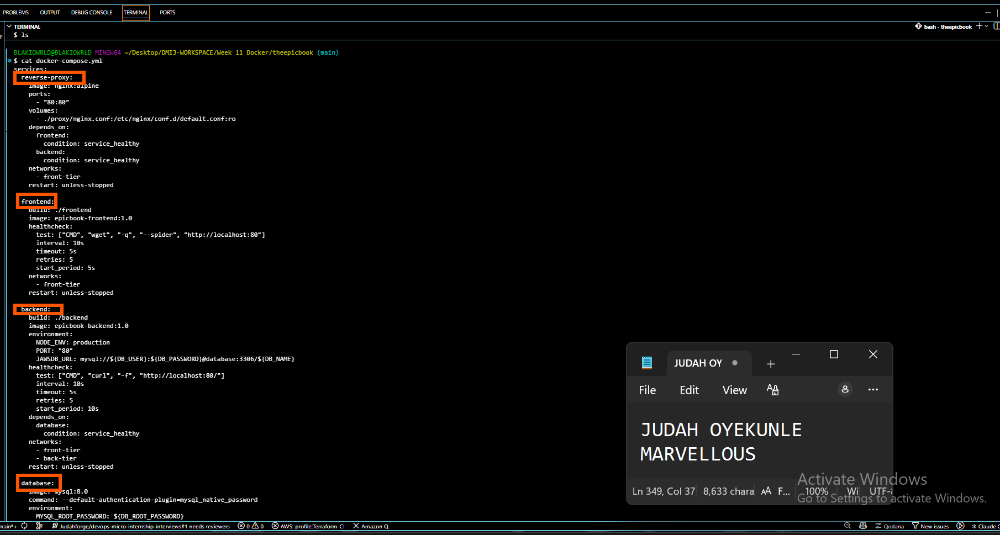

---

#### Screenshot 10 — Networks and Named Volume

Add a screenshot showing:

- `front-tier` network
- `back-tier` network
- `db_data` named volume

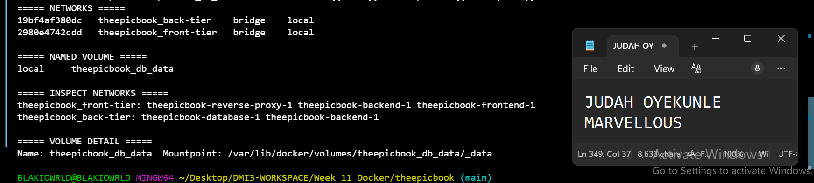

---

#### Screenshot 11 — Docker Compose Validation

Add a terminal screenshot showing successful Docker Compose validation without exposing environment-variable values or secrets.

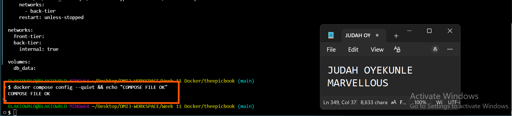

---

# Task 3 — Configure Health Checks and Startup Dependencies

## Goal

Configure health checks and ensure services start only after their dependencies are healthy.

### Evidence

#### Screenshot 12 — Backend Health Endpoint

Add a screenshot showing the backend application configuration for the `/health` endpoint.

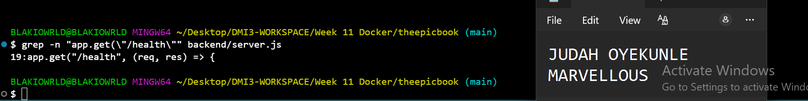

---

#### Screenshot 13 — MySQL and Backend Health Checks

Add a screenshot showing `docker-compose.yml` with health checks for MySQL and the backend.

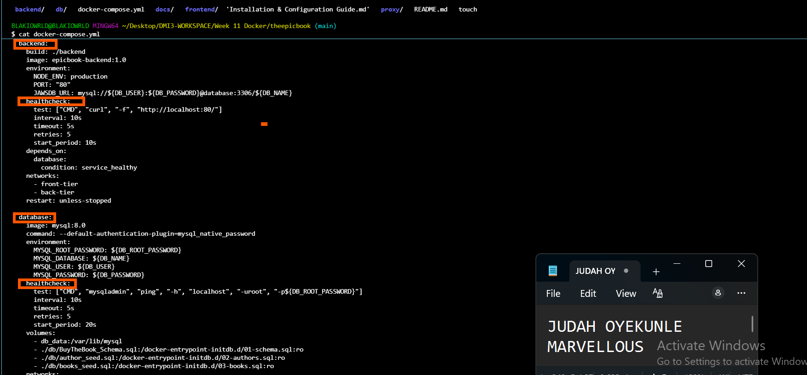

---

#### Screenshot 14 — Frontend and Reverse-Proxy Health Checks

Add a screenshot showing:

- Frontend health check
- Reverse-proxy health check
- `depends_on` conditions using `service_healthy`

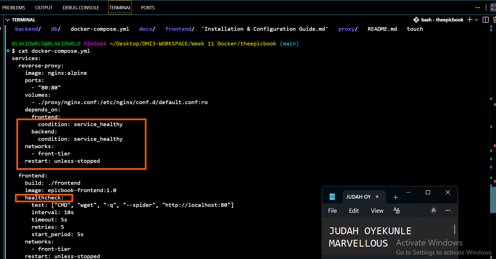

---

#### Screenshot 15 — Running Healthy Services

Add a terminal screenshot showing Docker Compose service status. The database, backend, frontend, and reverse proxy must be running successfully.

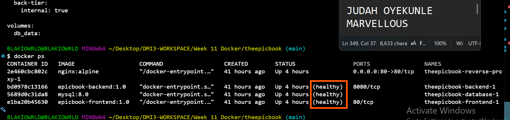

---

#### Screenshot 16 — Public Health Endpoint

Add a terminal screenshot showing a successful response from the public application health endpoint through the reverse proxy.

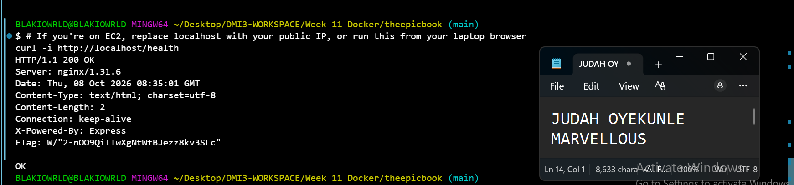

---

#### Screenshot 17 — Health-Check and Startup-Order Document

Add a screenshot showing the contents of:

```text
docs/03-healthchecks-and-depends-on.md
```

Explain the health-check method for each service and the startup dependency order.

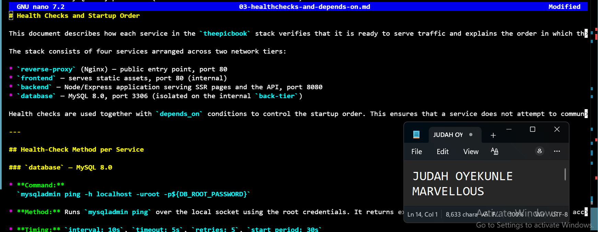

---

# Task 4 — Configure the Reverse Proxy and Same-Origin Routing

## Goal

Use either Nginx or Traefik as the only public entry point for the EpicBook application.

### Evidence

#### Screenshot 18 — Selected Reverse-Proxy Configuration

Add a screenshot showing the configuration for your selected reverse proxy.

It must show routes for:

- Static frontend assets
- Application pages
- API requests
- Health endpoint

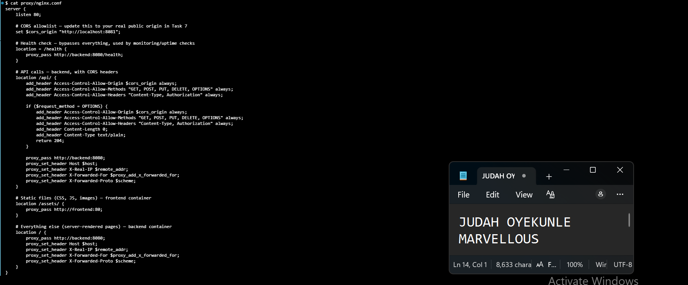

---

#### Screenshot 19 — Only Reverse Proxy Publishes Port 80

Add a screenshot of `docker-compose.yml` showing that only the `reverse-proxy` service publishes port 80.

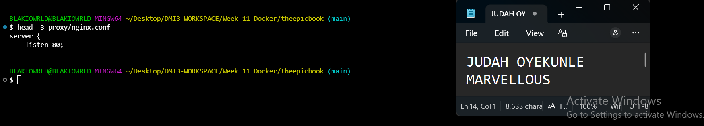

---

#### Screenshot 20 — Reverse-Proxy Route Testing

Add a terminal screenshot showing successful requests through the selected reverse proxy to:

- Application page
- One API endpoint
- One static asset
- Health endpoint

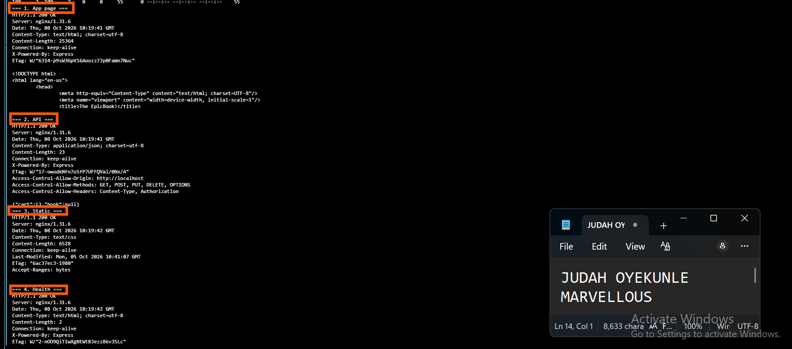

---

#### Screenshot 21 — EpicBook Application Through Public IP

Add a browser screenshot showing the EpicBook application loaded through the VM public IP address.

Add your full name as a clear caption below the screenshot.

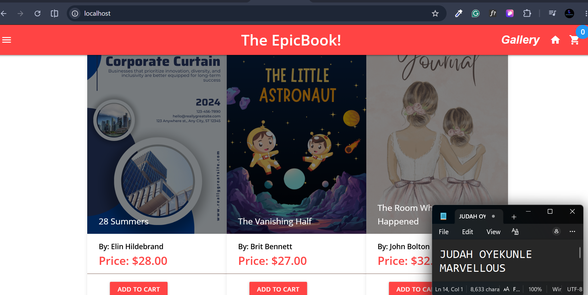

---

#### Screenshot 22 — Proxy Routing and CORS Document

Add a screenshot showing the contents of:

```text
docs/04-proxy-routing-and-cors.md
```

Explain the proxy routes and state whether CORS was required and why.

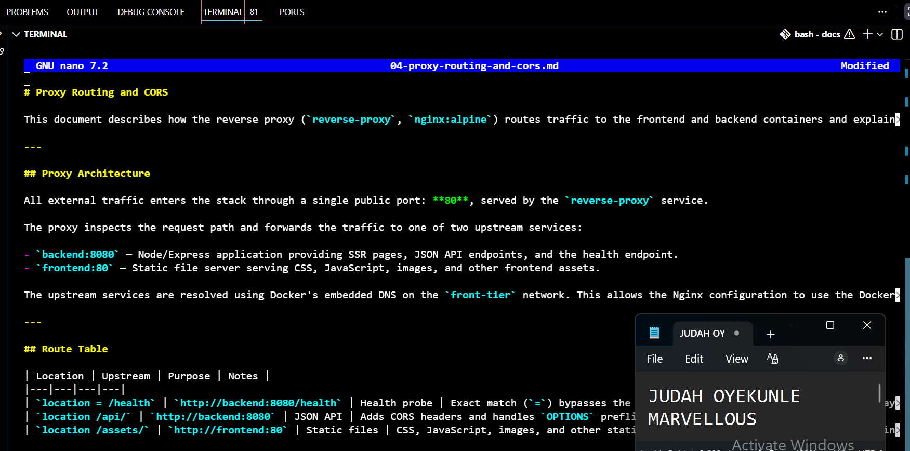

---

# Task 5 — Prove Data Persistence, Backup, and Restore

## Goal

Verify MySQL persistence and perform a controlled backup and restore drill.

### Evidence

#### Screenshot 23 — MySQL Volume Configuration

Add a terminal screenshot showing the `db_data` named volume and its MySQL mount configuration.

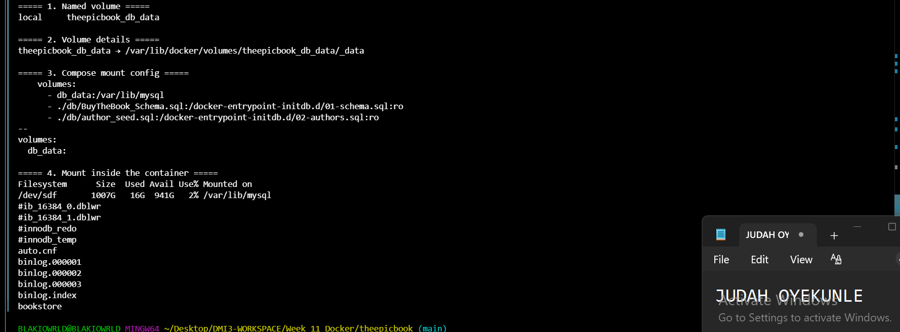

---

#### Screenshot 24 — Test Data Before Backup

Add a terminal screenshot showing the selected test data before the backup and restore drill.

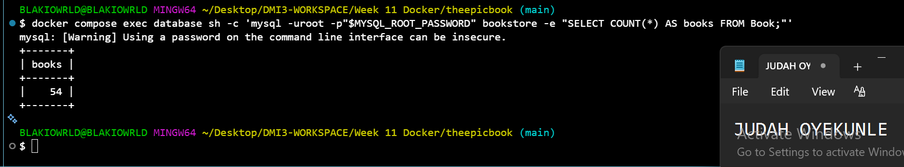

---

#### Screenshot 25 — Successful Backup Creation

Add a terminal screenshot showing successful backup creation and the backup file stored in the host backup directory.

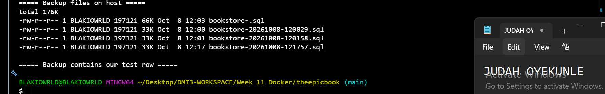

---

#### Screenshot 26 — Controlled Data-Loss Test

Add a terminal screenshot showing that the selected test record was removed during the controlled data-loss test.

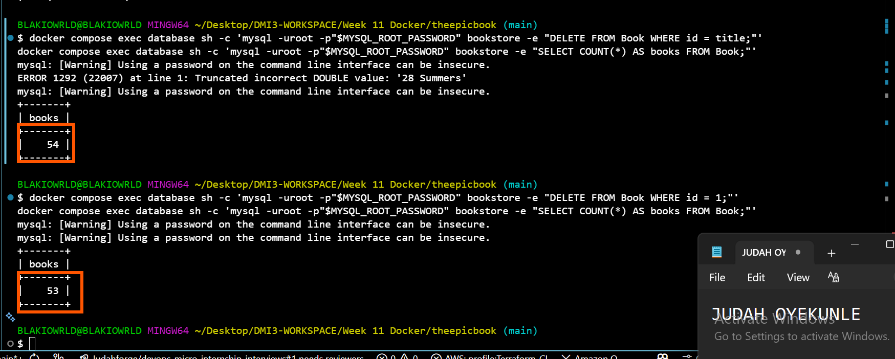

---

#### Screenshot 27 — Restore Verification

Add a terminal screenshot showing successful restore and verification that the deleted test record is available again.

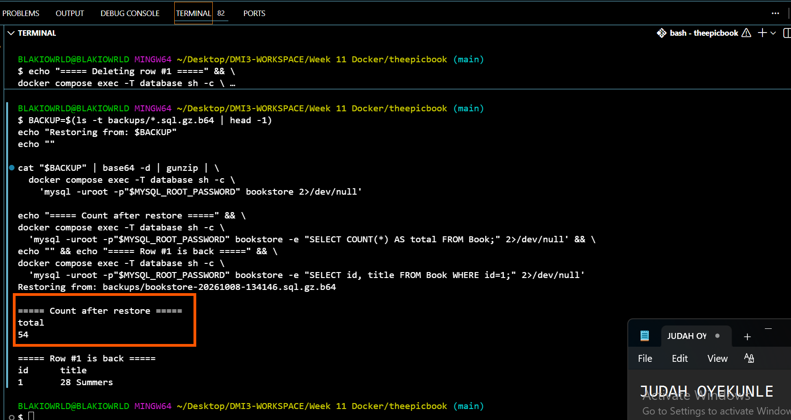

---

#### Screenshot 28 — Persistence After Down/Up Cycle

Add a terminal screenshot showing that database data remains available after a non-destructive Docker Compose down/up cycle.

Do not use `docker compose down -v`.

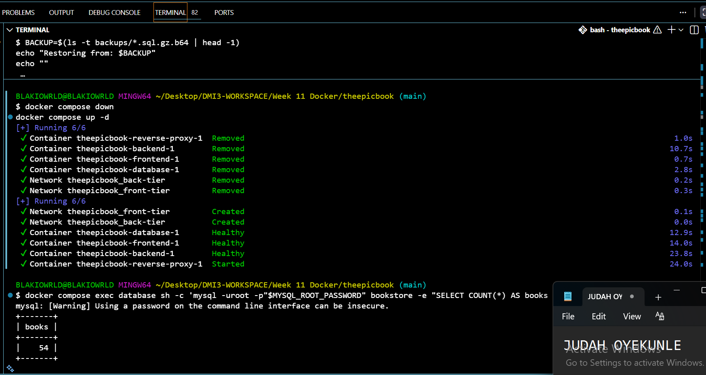

---

#### Screenshot 29 — Persistence and Backup Document

Add a screenshot showing the contents of:

```text
docs/05-persistence-and-backup.md
```

Include the backup plan and restore procedure.

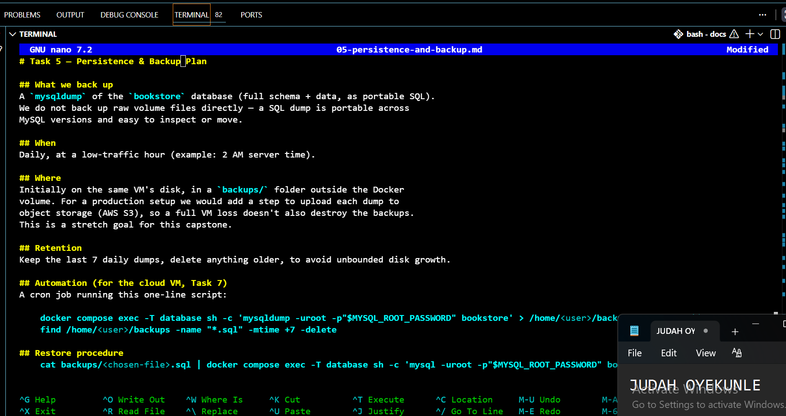

---

# Task 6 — Configure Logging and Observability

## Goal

Configure useful reverse-proxy and backend logs without exposing sensitive information.

### Evidence

#### Screenshot 30 — Logging Configuration

Add a screenshot showing:

- Configuration for the selected reverse proxy
- Proxy log format
- Docker Compose host log-directory bind mount

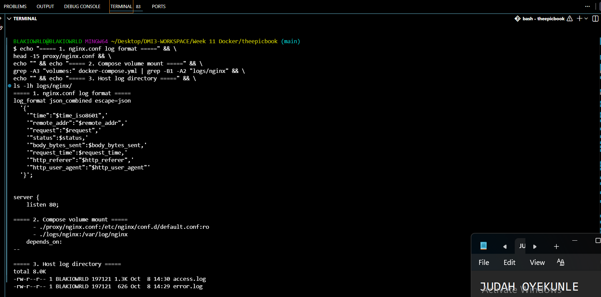

---

#### Screenshot 31 — Persistent Proxy Logs and Backend Logs

Add a terminal screenshot showing:

- Selected reverse-proxy logs available from the host directory after a proxy restart
- Backend logs displayed through Docker Compose

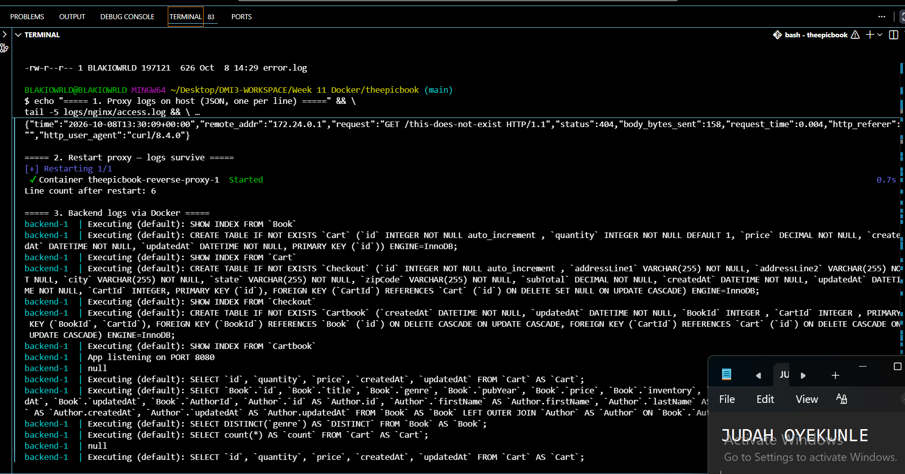

---

### Notes

Write a short note covering:

- The selected reverse proxy
- Host path used for reverse-proxy logs
- How backend logs are viewed
- Whether JSON or standard text logs were used
- Why passwords, tokens, headers, and database connection strings must not appear in logs

The selected reverse proxy is Nginx (nginx:alpine). Reverse-proxy logs are stored on the host in the configured host log directory so they can be accessed independently of the container. Backend logs can be viewed using Docker's container logs command, such as docker logs <backend-container>.

The reverse proxy uses JSON-formatted logs because structured logs are easy to parse and process by log shippers such as Fluent Bit, Filebeat, and the CloudWatch agent. The backend uses standard text logs because Express's default logger and Sequelize's query logs already produce plain-text output, which Docker's log driver can handle effectively. Mixing log formats is acceptable as long as sensitive information is excluded from both.

Why passwords, tokens, headers, and database connection strings must not appear in logs

Log files are often less protected than application data. They may be accessible to anyone with host access, shipped to third-party log storage, retained for long periods, or included in support tickets and debugging screenshots.

If a password, JWT, session token, Authorization header, or database connection string containing a password is written to a log, that secret is effectively exposed. Rotating the affected credential may then be required.

The json_combined logging format deliberately excludes sensitive values such as $http_authorization, $http_cookie, and request bodies. The backend also avoids logging request payloads. This keeps logs useful for troubleshooting while reducing the risk of exposing credentials and other sensitive information.

---

# Task 7 — Deploy and Verify the Stack on a Cloud VM

## Goal

Deploy the completed Docker Compose stack on an AWS or Azure VM and verify public access.

### Evidence

#### Screenshot 32 — VM Public IP and Inbound Rules

Add a cloud-console screenshot showing:

- VM public IP address
- SSH port 22 restricted to your IP address
- HTTP port 80 allowed from Anywhere

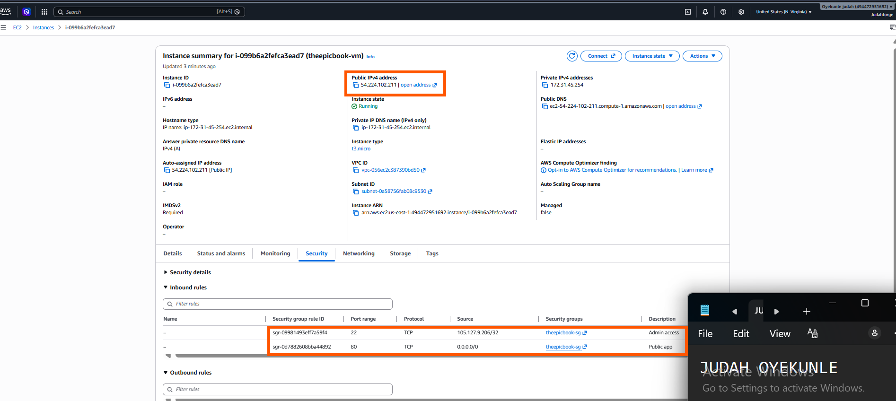

---

#### Screenshot 33 — Cloud VM Stack Verification

Add a VM terminal screenshot showing:

- Docker Compose service status
- Successful public health or API response
- No published database, frontend, or backend ports

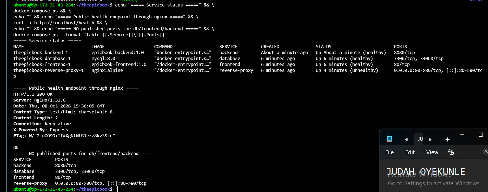

---

#### Screenshot 34 — EpicBook Application on Cloud VM

Add a browser screenshot showing the EpicBook application loaded through the VM public IP address.

Add your full name as a clear caption below the screenshot.

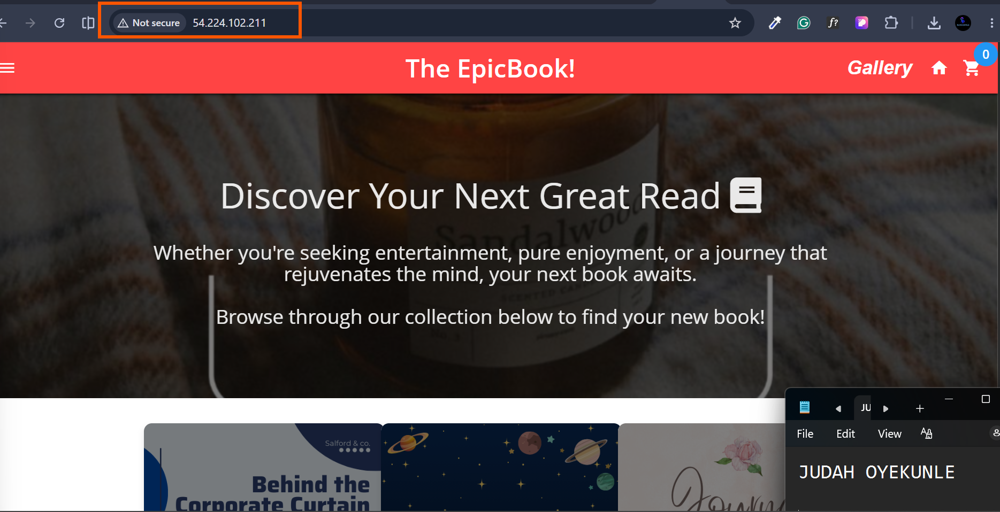

---

### Notes

Write a short note covering:

- Cloud provider used
- VM operating system
- Public port exposed
- Security rules configured
- Confirmation that the application and backend API worked through the reverse proxy

## Provider
AWS — Amazon EC2.

## VM Operating System
Ubuntu 24.04 LTS.

## Public Port Exposed
**Port 80 only.** The `reverse-proxy` service publishes `80:80`, so all
external traffic enters the stack through Nginx. The `backend`,
`frontend`, and `database` services publish no ports to the host; they are
reachable only over the internal Docker networks (`front-tier` and
`back-tier`). This means an attacker on the public internet cannot open a
direct connection to MySQL, to the Express API, or to the frontend
container — every request must traverse Nginx first.

## Security Rules Configured

| Type | Port | Source        | Purpose |
|------|------|---------------|---------|
| SSH  | 22   | My IP /32     | Administrative access, restricted to a single trusted address |
| HTTP | 80   | 0.0.0.0/0     | Public access to the application through the reverse proxy |

No rules were added for ports 3000, 3001, 3306, 8080, or any other
service port. Those services are intentionally not reachable from outside
the VM.

## Verification

- `docker compose ps` shows all four services `Up` and `(healthy)`:
  `reverse-proxy`, `frontend`, `backend`, `database`.
- `curl -i http://localhost/health` from the VM returns `200 OK` with a
  JSON body from the backend, proving the reverse proxy successfully
  forwards to the API.
- `docker compose ps --format 'table {{.Service}}\t{{.Ports}}'` shows a
  published port **only** for `reverse-proxy` (`0.0.0.0:80->80/tcp`).
  `database`, `frontend`, and `backend` show no host-side port binding.
- Opening `http://<vm-public-ip>/` in a browser loads the EpicBook
  application, confirming end-to-end reachability through the proxy.

## Confirmation
The application and the backend API both work through the reverse proxy at
`http://54.224.102.211/` and `http://54.224.102.211/health` respectively.
No direct container port is exposed to the internet. The stack reproduces
exactly the behaviour observed locally, with the only difference being
that inbound traffic now originates from the public internet rather than
the developer's machine.

---

# Task 8 — Automate Deployment with CI/CD (Optional)

## Goal

Optionally automate image build, image push, and deployment through GitHub Actions or Azure Pipelines.

### Optional Evidence

#### Optional Screenshot — Successful CI/CD Pipeline Run

Add a screenshot showing a successful pipeline run with build, image push, deployment, and verification stages.

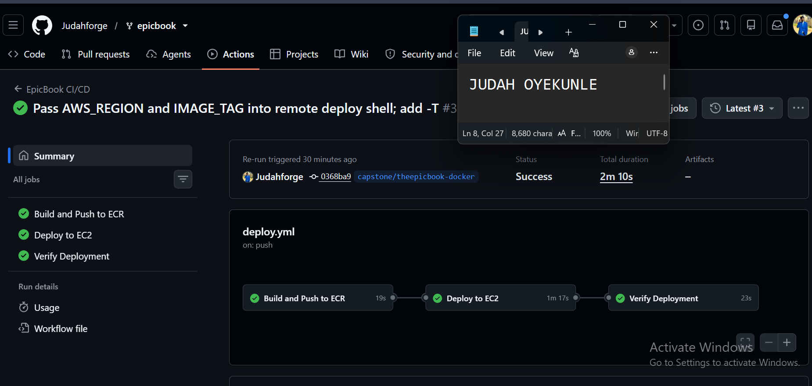

---

### Optional Notes

Write a short note covering:

- CI/CD platform used
- Image-tagging method
- Registry used
- Deployment trigger
- Manual approval or secret-handling approach

##CI/CD Platform Used
GitHub Actions. The pipeline is defined in .github/workflows/deploy.yml at the root of the repository. It runs on GitHub-hosted ubuntu-latest runners and requires no additional CI/CD infrastructure beyond what the repo already provides.

##Image-Tagging Method
Each image is tagged with the full commit SHA (${{ github.sha }}), giving a unique, immutable tag per build. This makes every deployment traceable to an exact source revision and enables rollbacks by re-deploying a previous SHA. latest is deliberately not used, so a deploy never picks up an unintended image.

##Registry Used
Amazon Elastic Container Registry (ECR) — repositories epicbook/backend and epicbook/frontend. Builds push to ECR from the GitHub runner; the EC2 instance pulls from ECR using its attached IAM instance profile (EC2-ECR-Pull-Role), so no long-lived AWS credentials are stored on the VM.

##Deployment Trigger
Triggered by a push to the capstone/theepicbook-docker branch that modifies files under backend/, frontend/, proxy/, docker-compose.yml, or the workflow file itself. Path filters prevent unnecessary runs on docs-only changes. Also available for manual run via workflow_dispatch.

##Manual Approval and Secret-Handling Approach
No manual approval gate — the pipeline runs fully automated, which is appropriate for a lab environment. Sensitive values are stored as GitHub repository secrets and never appear in the workflow file or logs:

AWS_ACCESS_KEY_ID / AWS_SECRET_ACCESS_KEY — an IAM user scoped to ECR push permissions only.

EC2_SSH_KEY — the private key, stored base64-encoded so GitHub's multi-line handling cannot corrupt it; decoded on the runner with base64 -d.

EC2_HOST, EC2_USER — connection details.

DB_USER, DB_PASSWORD, DB_ROOT_PASSWORD — database credentials.

The secrets are passed into the remote shell as inline environment variables (ECR_REGISTRY=… AWS_REGION=… IMAGE_TAG=… bash -s), so they are only materialised inside the SSH session for the duration of the deploy step. GitHub masks them in the logs automatically.

##Deployment Mechanism (brief)
The pipeline has three jobs:

build-and-push — authenticates to AWS, builds both images, pushes to ECR.

deploy — copies docker-compose.yml and proxy/nginx.conf to the VM via scp, then SSHes in to authenticate to ECR, pull the new images, and run docker compose up -d --remove-orphans.

verify — curls http://54.224.102.211/health and fails the pipeline if the response is not 200 OK.

The ordering (needs: build-and-push → needs: deploy) guarantees the VM only ever receives a fully built and previously succeeded deployment.

---

# Task 9 — Perform Reliability Tests and Create an Operations Runbook

## Goal

Test controlled service failures and document safe operating procedures.

### Evidence

#### Screenshot 35 — Backend Failure and Recovery

Add a terminal screenshot showing:

- Backend failure test
- Expected unavailable response through the reverse proxy
- Backend restart
- Successful health-check recovery

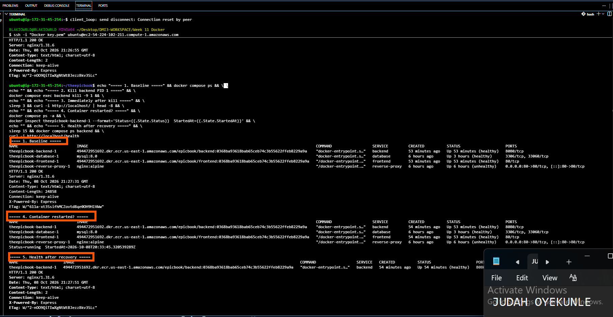

---

#### Screenshot 36 — Database Failure and Recovery

Add a terminal screenshot showing:

- Database outage test
- Failed database-dependent request
- Database restart
- Successful application recovery

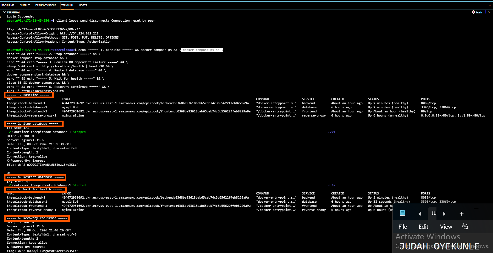

---

### Notes

Write a short operations runbook covering:

- Safe restart procedure for reverse proxy, frontend, backend, and database
- Backup and restore procedure
- Secret-rotation approach
- Database recovery procedure
- What to check when the application returns an error
- Results of backend and database reliability tests

# EpicBook — Operations Runbook

## 1. Safe Restart Procedures

Restart individual services:

```bash
docker compose restart reverse-proxy
docker compose restart frontend
docker compose restart backend
docker compose restart database
```

Restart the entire stack:

```bash
docker compose down
docker compose up -d
```

The `db_data` volume preserves database contents when `docker compose down` is used without `-v`. **Avoid `docker compose down -v` unless you intend to delete the database volume.**

## 2. Backup and Restore

Create a compressed database backup:

```bash
mkdir -p backups
STAMP=$(date +%Y%m%d-%H%M%S)

docker compose exec -T database sh -c \
  'mysqldump -uroot -p"$MYSQL_ROOT_PASSWORD" bookstore 2>/dev/null' \
  | gzip | base64 > "backups/bookstore-${STAMP}.sql.gz.b64"
```

Restore a backup by replacing `<STAMP>` with the backup's timestamp:

```bash
cat "backups/bookstore-<STAMP>.sql.gz.b64" \
  | base64 -d | gunzip \
  | docker compose exec -T database sh -c \
  'mysql -uroot -p"$MYSQL_ROOT_PASSWORD" bookstore'
```

Always verify the backup and protect existing data before restoring.

## 3. Secret Rotation

1. Generate a new secret using `openssl rand -hex 16`.
2. Update the relevant variable in the VM's `.env` file.
3. For database passwords, update the MySQL user's password and ensure the backend uses the matching new value.
4. Recreate the backend to apply updated environment variables:

```bash
docker compose up -d --force-recreate backend
```

5. Update CI/CD secrets in GitHub Actions settings when necessary.

Never commit secrets or expose them in logs.

## 4. Logs

| Service       | Command                                       |
| ------------- | --------------------------------------------- |
| Reverse proxy | `tail -f ~/theepicbook/logs/nginx/access.log` |
| Backend       | `docker compose logs backend --tail 100 -f`   |
| Database      | `docker compose logs database --tail 100 -f`  |
| All services  | `docker compose logs -f`                      |

The proxy uses JSON logs, while backend logs use standard text. Passwords, tokens, authorization headers, and database connection strings must not appear in logs because they can expose sensitive credentials.

## 5. Database Recovery

Check database logs:

```bash
docker compose logs database --tail 100
```

Check database health:

```bash
docker compose exec database sh -c \
  'mysqladmin ping -h localhost -uroot -p"$MYSQL_ROOT_PASSWORD"'
```

If the database cannot recover, investigate disk space, credentials, and data corruption. Restore from a verified backup if necessary.

## 6. Troubleshooting Application Errors

Run these checks in order:

```bash
docker compose ps
docker compose logs backend --tail 50
docker compose logs database --tail 50
curl -i http://localhost/health
curl -i http://localhost/
```

* **502:** Check whether the backend is running and healthy.
* **504:** Check backend responsiveness and database availability.
* **5xx health response:** Investigate backend and database logs.
* **Local access works but remote access fails:** Check the VM firewall, security group, and network configuration.

## 7. Reliability Test Results

Tests were performed on the EC2 production stack on **8 October 2026**.

* **Backend crash:** Killing the backend process triggered an automatic container restart. The health endpoint returned HTTP 200.
* **Database outage:** Stopping the database caused a 5xx response. After restarting the database, the backend recovered and the health endpoint returned HTTP 200.
* **Data persistence:** The database contained 54 books before and after a full stack restart, confirming that the `db_data` volume persisted.

Screenshots 35 and 36 document the backend and database recovery tests.


---

# Final Public Application URL

**EpicBook URL:** `http://54.224.102.211`

Replace the placeholder with your working public URL.

---

# GitHub Repository URL

**Your Fork or Repository URL:** `https://github.com/Judahforge/epicbook.git`

---

# LinkedIn Requirement

## Goal

Create a professional LinkedIn post of 6–10 lines about your EpicBook capstone deployment.

Your post must include:

- The architectural decision that most improved reliability
- Your biggest image-size reduction, with numbers
- Key production-hardening lessons
- A deployment verification image

### Evidence

**LinkedIn Post URL:** `https://lnkd.in/p/dgJdsxha`

#### LinkedIn Post Screenshot

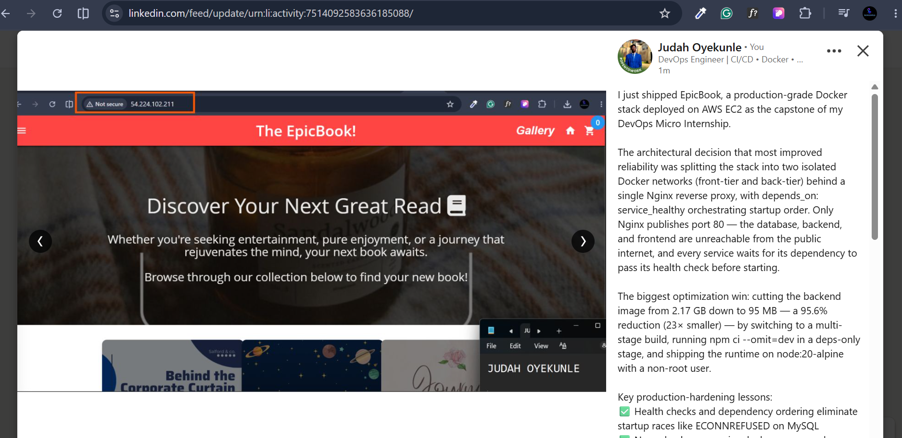

---

# Submission Checklist

- [ ] EpicBook repository reviewed and architecture diagram created
- [ ] Environment variables, ports, persistence, and health-check details documented
- [ ] Backend and frontend production Dockerfiles created
- [ ] Backend runs as a non-root user
- [ ] Docker image-size comparison completed
- [ ] Docker Compose stack includes reverse proxy, frontend, backend, and database
- [ ] `front-tier` and `back-tier` networks configured
- [ ] `db_data` named volume configured
- [ ] MySQL, backend, frontend, and reverse-proxy health checks configured
- [ ] Startup dependencies use `service_healthy`
- [ ] Nginx or Traefik selected as the only public reverse proxy
- [ ] Only reverse-proxy port 80 is publicly published
- [ ] Same-origin routing configured and CORS used only when required
- [ ] Backup, restore, and persistence testing completed
- [ ] Reverse-proxy and backend logs verified
- [ ] Cloud VM deployment verified through the public IP
- [ ] Backend and database reliability tests completed
- [ ] Screenshots 1–36 included
- [ ] Required notes completed
- [ ] LinkedIn post URL and screenshot included
- [ ] Full name visible in required screenshots or captions
- [ ] No passwords, tokens, private keys, account IDs, or other sensitive information exposed

---

## 📌 About DMI & CloudAdvisory

DevOps Micro Internship (DMI) is a project-based DevOps program run by Pravin Mishra (The CloudAdvisory) focused on real-world execution, systems thinking, and career readiness.

It helps learners build strong DevOps foundations with hands-on experience.

---

## 📌 Resources

- 🌐 DMI Official Website: https://dmi.pravinmishra.com?utm_source=github&utm_medium=readme  
- 🎓 University: https://university.pravinmishra.com?utm_source=github&utm_medium=readme  
- 💬 Discord Community: https://discord.pravinmishra.com?utm_source=github&utm_medium=readme  
- 📝 Blog: https://dmi.pravinmishra.com/blog?utm_source=github&utm_medium=readme  
- ▶️ YouTube Playlist: https://www.youtube.com/playlist?list=PLFeSNDtI4Cho  
- 🔗 Pravin Mishra (LinkedIn): https://www.linkedin.com/in/pravin-mishra-aws-trainer/  
- 🏢 CloudAdvisory (LinkedIn): https://www.linkedin.com/company/thecloudadvisory/

---

*This submission is part of DevOps Micro Internship (DMI) — Agentic AI Track.*
